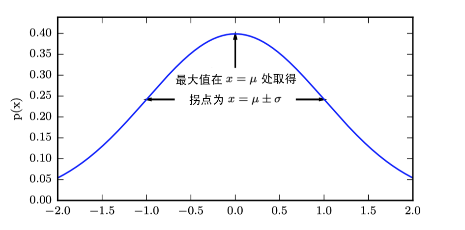

### 第 1 章 数学基础

 

 

数学是一切知识中的最高形式。

—— 柏拉图

 

 

这一章我们将介绍理解机器学习所需的基本数学概念。我们从应用数学的一般概念开始，这能使我们定义许多变量的函数，并且找到这些函数的最高和最低点。

#### 1.1  线性代数概念

线性代数包含以下几个基本的数学概念：

- **标量**：一个标量就是一个单独的数。

- **向量**：一个向量是一列数，通常用粗体的小写变量表示，例如 $\boldsymbol{x}$。
  $$
  \boldsymbol{x} = \begin{bmatrix} x_1\\x_2\\\vdots\\x_n \end{bmatrix}
  $$

- **矩阵**：矩阵是一个二维数组，通常用粗体的大写变量表示，例如 $\boldsymbol{A}$。
  $$
  \boldsymbol{A} = \begin{bmatrix} A_{1,1}&\cdots&A_{1,n}\\
  \vdots&\ddots&\vdots
  \\A_{m,1} &\cdots&A_{m,n}\end{bmatrix}
  $$

- **张量**：坐标超过两维的数组。

矩阵的**转置**是以对角线为轴的镜像，这条从左上角到右下角的对角线被称为**主对角线**。我们将矩阵 $\boldsymbol{A}$ 的转置表示为 $\boldsymbol{A}^\top$，定义为：
$$
(\boldsymbol{A}^\top)_{i,j} = \boldsymbol{A}_{j,i} \tag{1-1}
$$

在机器学习中，我们允许矩阵和向量相加产生另一个矩阵：$\boldsymbol{C} = \boldsymbol{A} + \boldsymbol{b}$，其中 $C_{i,j} = A_{i,j} + b_j$，即向量 $\boldsymbol{b}$ 和矩阵 $\boldsymbol{A}$ 的每一行相加。这种隐式地在加法操作前将向量 $\boldsymbol{b}$ 复制到每一行生成矩阵的方式，被称为**广播**。

两个矩阵 $\boldsymbol{A}$ 和 $\boldsymbol{B}$ 的矩阵乘积是第三个矩阵 $\boldsymbol{C}$，其中矩阵 $\boldsymbol{A}$ 的列数必须和矩阵 $\boldsymbol{B}$ 的行数相等。如果矩阵 $\boldsymbol{A}$ 的形状是 $m \times n$，矩阵 $\boldsymbol{B}$ 的形状是 $n \times p$，那么矩阵 $\boldsymbol{C}$ 的形状是 $m \times p$：
$$
\boldsymbol{C} = \boldsymbol{A}\boldsymbol{B} \tag{1-2}
$$
具体地，该乘法操作定义为：
$$
C_{i,j} = \sum_{k}A_{i,k} B_{k,j}
$$
两个矩阵的标准乘积不是两个矩阵中对应元素的乘积，那种操作被称为**元素对应乘积**，记为 $\boldsymbol{A}\odot\boldsymbol{B}$。两个相同维数的向量 $\boldsymbol{x}$ 和 $\boldsymbol{y}$ 的**点积**可以看作矩阵乘积 $\boldsymbol{x}^\top\boldsymbol{y}$。 

线性方程组可以用矩阵形式表示为：
$$
\boldsymbol{A}\boldsymbol{x} = \boldsymbol{b} \tag{1-3}
$$
其中 $\boldsymbol{A}\in\mathbb{R}^{m\times n}$ 是一个已知矩阵，$\boldsymbol{b}\in\mathbb{R}^{m}$ 是一个已知向量，$\boldsymbol{x}\in\mathbb{R}^{n}$ 是一个我们要求解的未知向量。矩阵 $\boldsymbol{A}$ 的每一行和 $\boldsymbol{b}$ 中对应的元素构成一个约束，可以将式 $\text{(1-3)}$ 重写为： 
$$
\begin{align}
\boldsymbol{A}_{1,1}x_1 + \cdots + \boldsymbol{A}_{1,n}x_n &= b_1 \\
\boldsymbol{A}_{2,1}x_1 + \cdots + \boldsymbol{A}_{2,n}x_n &= b_2 \\
...\\
\boldsymbol{A}_{m,1}x_1 + \cdots + \boldsymbol{A}_{m,n}x_n &= b_m
\end{align}
$$
任意向量和**单位矩阵**相乘都不会改变，我们将保持 $n$ 维向量不变的单位矩阵记作 $\boldsymbol{I}_n$。形式上，$\boldsymbol{I}_n \in \mathbb{R}^{n\times n}$，
$$
\forall \boldsymbol{x} \in \mathbb{R}^{n},\boldsymbol{I}_n\boldsymbol{x} = \boldsymbol{x} \tag{1-4}
$$
单位矩阵的结构很简单：所有沿主对角线的元素都是 1，而所有其他位置的元素都是 0。

矩阵 $\boldsymbol{A}$ 的**矩阵逆**记作 $\boldsymbol{A}^{−1}$，其定义的矩阵满足：
$$
\boldsymbol{A}^{-1}\boldsymbol{A} = \boldsymbol{I}_n \tag{1-5}
$$
我们可以通过以下步骤求解式 $\text{(1-3)}$：
$$
\begin{gather}
\boldsymbol{A}\boldsymbol{x} = \boldsymbol{b}\\
\boldsymbol{A}^{-1}\boldsymbol{A}\boldsymbol{x} = \boldsymbol{A}^{-1}\boldsymbol{b}\\
\boldsymbol{I}_n\boldsymbol{x} = \boldsymbol{A}^{-1}\boldsymbol{b}\\
\boldsymbol{x} = \boldsymbol{A}^{-1}\boldsymbol{b}
\end{gather}
$$
当逆矩阵 $\boldsymbol{A}^{-1}$ 存在时，有几种不同的算法都能找到它的闭解形式。然而，逆矩阵 $\boldsymbol{A}^{−1}$ 主要是作为理论工具使用的，并不会在大多数软件应用程序中实际使用。因为逆矩阵 $\boldsymbol{A}^{−1}$ 在数字计算机上只能表现出有限的精度，有效使用向量 $\boldsymbol{b}$ 的算法通常可以得到更精确的 $\boldsymbol{x}$。

#### 1.2 线性相关和生成子空间

如果逆矩阵 $\boldsymbol{A}^{−1}$ 存在，那么式 $\text{(1-3)}$ 肯定对于每一个向量 $\boldsymbol{b}$ 恰好存在一个解。但是，对于方程组而言，对于向量 $\boldsymbol{b}$ 的某些值，有可能不存在解，或者存在无限多个解。

为了分析方程有多少个解，我们可以将 $\boldsymbol{A}$ 的列向量看作从原点出发的不同方向，确定有多少种方法可以到达向量 $\boldsymbol{b}$。向量 $\boldsymbol{x}$ 中的每个元素表示我们应该沿着这些方向走多远，即 $x_i$ 表示我们需要沿着第 $i$ 个向量的方向走多远：
$$
\boldsymbol{A}\boldsymbol{x} = \sum_{i}x_i\boldsymbol{A}_{:,i}
$$
这种操作被称为**线性组合**。一组向量的线性组合，是指每个向量乘以对应标量系数之后的和，即：
$$
\sum_{i}c_i\boldsymbol{v}^{(i)} \tag{1-6}
$$
一组向量的**生成子空间**是原始向量线性组合后所能抵达的点的集合。

确定 $\boldsymbol{A}\boldsymbol{x} = \boldsymbol{b}$ 是否有解相当于确定向量 $\boldsymbol{b}$ 是否在 $\boldsymbol{A}$ 列向量的生成子空间中。这个特殊的生成子空间被称为 $\boldsymbol{A}$ 的**列空间**或者 $\boldsymbol{A}$ 的**值域**。

为了使方程 $\boldsymbol{A}\boldsymbol{x} = \boldsymbol{b}$ 对于任意向量 $\boldsymbol{b} \in \mathbb{R} ^{m}$ 都存在解，我们要求 $\boldsymbol{A}$ 的列空间构成整个 $\mathbb{R}^{m}$。矩阵 $\boldsymbol{A}$ 的列空间是整个 $\mathbb{R}^{m}$ 的要求，意味着 $\boldsymbol{A}$ 至少有 $m$ 列，即 $n \ge m$。否则，$\boldsymbol{A}$ 列空间的维数会小于 $m$。 

> 例如，假设 $\boldsymbol{A}$ 是一个 $3\times 2$ 的矩阵，目标 $\boldsymbol{b}$ 是 3 维的，但是 $\boldsymbol{x}$ 只有 2 维。所以无论如何修改 $\boldsymbol{x}$ 的值，也只能描绘出 $\mathbb{R}^{3}$ 空间中的二维平面。当且仅当向量 $\boldsymbol{b}$ 在该二维平面中时，该方程有解。

不等式 $n \ge m$ 仅是方程对每一点都有解的必要条件。这不是一个充分条件，因为有些列向量可能是冗余的，这种冗余被称为**线性相关**。如果一组向量中的任意一个向量都不能表示成其他向量的线性组合，那么这组向量称为**线性无关**。如果一个矩阵的列空间涵盖整个 $\mathbb{R}^m$，那么该矩阵必须包含至少一组 $m$ 个线性无关的向量，这是式 $\text{(1-3)}$ 对于每一个向量 $\boldsymbol{b}$ 的取值都有解的充分必要条件。

要想使矩阵可逆，我们还需要保证式 $\text{(1-3)}$ 对于每一个 $\boldsymbol{b}$ 值至多有一个解。为此，我们需要确保该矩阵至多有 $m$ 个列向量。否则，该方程会有不止一个解。

综上所述，这意味着该矩阵必须是一个**方阵**，即 $m = n$，并且所有列向量都是线性无关的。一个列向量线性相关的方阵被称为**奇异的**。

> 如果矩阵 $\boldsymbol{A}$ 不是一个方阵或者是一个奇异的方阵，该方程仍然可能有解。但是我们不能使用矩阵逆去求解。 

#### 1.3 范数

在机器学习中，我们经常使用被称为**范数**的函数衡量向量大小。范数是将向量映射到非负值的函数。直观上来说，向量 $\boldsymbol{x}$ 的范数衡量从原点到点 $\boldsymbol{x}$ 的距离。形式上，$L^p$ 范数定义如下：
$$
\Vert\boldsymbol{x}\Vert_p = \Bigg(\sum_{i}\vert x_i\vert^p\Bigg)^{\frac{1}{p}} \tag{1-7}
$$
其中 $p \in \mathbb{R}$，$p \ge 1$。当 $p = 2$ 时，$L^2$ 范数被称为**欧几里得范数**。它表示从原点出发到向量 $\boldsymbol{x}$ 确定的点的欧几里得距离。

平方 $L^2​$ 范数也经常用来衡量向量的大小，可以简单地通过点积 $\boldsymbol{x}^\top\boldsymbol{x}​$ 计算。平方 $L^2​$ 范数在数学和计算上都比 $L^2​$ 范数本身更方便。例如，平方 $L^2​$ 范数对 $\boldsymbol{x}​$ 中每个元素的导数只取决于对应的元素，而 $L^2​$ 范数对每个元素的导数却和整个向量相关。平方 $L^2​$ 范数也可能不受欢迎，因为它在原点附近增长得十分缓慢。在某些机器学习应用中，区分恰好是零的元素和非零但值很小的元素是很重要的。在这些情况下，我们转而使用在各个位置斜率相同，同时保持简单的数学形式的函数：$L^1​$ 范数。$L^1​$ 范数可以简化如下：
$$
\Vert\boldsymbol{x}\Vert_1 = \sum_{i}\vert x_i\vert \tag{1-8}
$$
当机器学习问题中零和非零元素之间的差异非常重要时，通常会使用 $L^1$ 范数。每当 $\boldsymbol{x}$ 中某个元素从 0 增加 $\epsilon$，对应的 $L^1$ 范数也会增加 $\epsilon$。

另外一个经常使用的范数是 $L^\infty$ 范数，也被称为**最大范数**。这个范数表示向量中具有最大幅值的元素的绝对值：
$$
\Vert\boldsymbol{x}\Vert_\infty = \max_{i}\vert x_i\vert \tag{1-9}
$$
有时候我们可能也希望衡量矩阵的大小。在深度学习中， 最常见的做法是使用 **Frobenius 范数**，其类似于向量的 $L^2$ 范数：
$$
\Vert\boldsymbol{A}\Vert_F = \sqrt{\sum_{i,j} A^2_{i,j}} \tag{1-10}
$$
两个向量的**点积**可以用范数来表示，具体如下
$$
\boldsymbol{x}^\top\boldsymbol{y} = \Vert\boldsymbol{x}\Vert_2\Vert\boldsymbol{y}\Vert_2\cos\theta
$$

#### 1.4 矩阵分解

许多数学对象可以通过将它们分解成多个组成部分或者找到它们的一些属性而更好地理解，这些属性是通用的，而不是由我们选择表示它们的方式产生的。

**特征分解**是使用最广的矩阵分解之一，即我们将矩阵分解成一组特征向量和特征值。

方阵 $\boldsymbol{A}$ 的**特征向量**是指与 $\boldsymbol{A}$ 相乘后相当于对该向量进行缩放的非零向量 $\boldsymbol{v}$：
$$
\boldsymbol{A}\boldsymbol{v} = \lambda\boldsymbol{v} \tag{1-11}
$$
其中标量 $\lambda$ 被称为这个特征向量对应的**特征值**。

假设矩阵 $\boldsymbol{A}$ 有 $n$ 个线性无关的特征向量 $\{\boldsymbol{v}^{(1)} , \cdots , \boldsymbol{v}^{(n)} \}$，对应着特征值 $\{\lambda_1, \cdots , \lambda_n \}$。于是，我们可以得到
$$
\begin{align}
\boldsymbol{A}\boldsymbol{v}^{(1)} &= \lambda_1\boldsymbol{v}^{(1)}\\
\boldsymbol{A}\boldsymbol{v}^{(2)} &= \lambda_2\boldsymbol{v}^{(2)}\\
\cdots\\
\boldsymbol{A}\boldsymbol{v}^{(n)} &= \lambda_n\boldsymbol{v}^{(n)}
\end{align}
$$
我们将特征向量连接成一个矩阵，使得每一列是一个特征向量：$\boldsymbol{V} = [\boldsymbol{v}^{(1)} , \cdots , \boldsymbol{v}^{(n)} ]$。类似地，我们也可以将特征值连接成一个向量 $\boldsymbol{\lambda} = [\lambda_1 , \cdots , \lambda_n ]^\top$ 。上面的式子可以写成矩阵形式：
$$
\boldsymbol{A}\boldsymbol{V} = \boldsymbol{V}\text{diag}(\boldsymbol{\lambda})
$$

> **对角矩阵**只在主对角线上含有非零元素，其他位置都是零。我们用 $\text{diag}(\boldsymbol{v})$ 表示一个对角元素由向量 $\boldsymbol{v}$ 中元素给定的对角方阵。计算乘法 $\text{diag}(\boldsymbol{v})\boldsymbol{x}$，只需要将 $\boldsymbol{x}$ 中的每个元素 $x_i$ 放大 $v_i$ 倍，即 $\text{diag}(\boldsymbol{v})\boldsymbol{x} = \boldsymbol{v} \odot \boldsymbol{x}$。

因此 $\boldsymbol{A}$ 的**特征分解**可以记作
$$
\boldsymbol{A} = \boldsymbol{V}\text{diag}(\boldsymbol{\lambda})\boldsymbol{V}^{-1} \tag{1-12}
$$
注意，不是每一个矩阵都可以分解成特征值和特征向量，但是每个实对称矩阵都可以分解成实特征向量和实特征值，虽然特征分解可能并不唯一：
$$
\boldsymbol{A} = \boldsymbol{Q}\boldsymbol{\Lambda}\boldsymbol{Q}^\top \tag{1-13}
$$
其中 $\boldsymbol{Q}$ 是 $\boldsymbol{A}$ 的特征向量组成的正交矩阵，$\boldsymbol{\Lambda}$ 是对角矩阵。特征值 $\Lambda_{i,i}$ 对应的特征向量是矩阵 $\boldsymbol{Q}$ 的第 $i$ 列，记作 $\boldsymbol{Q}_{:,i}$。

> **单位向量**是具有**单位范数**的向量：
> $$
> \Vert\boldsymbol{x}\Vert_2 = 1
> $$
> 如果 $\boldsymbol{x}^\top\boldsymbol{y} = 0$，那么向量 $\boldsymbol{x}$ 和向量 $\boldsymbol{y}$ 互相**正交**。如果两个向量不仅互相正交，并且范数都为 1，那么我们称它们是**标准正交**。
>
> **正交矩阵**是指行向量和列向量是分别标准正交的方阵，即 $\boldsymbol{A}^\top\boldsymbol{A} = \boldsymbol{A}\boldsymbol{A}^\top = \boldsymbol{I}$，这意味着 $\boldsymbol{A}^{-1} = \boldsymbol{A}^\top$。

矩阵的特征分解给了我们很多关于矩阵的有用信息。矩阵是奇异的当且仅当含有零特征值。

所有特征值都是正数的矩阵被称为**正定**；所有特征值都是非负数的矩阵被称为**半正定**。同样地，所有特征值都是负数的矩阵被称为**负定**；所有特征值都是非正数的矩阵被称为**半负定 **。

除了将矩阵分解成特征向量和特征值以外，还有另一种分解矩阵的方法称为**奇异值分解**，将矩阵分解为**奇异向量**和**奇异值**。每个实数矩阵都有一个奇异值分解，但不一定都有特征分解。例如，非方阵的矩阵没有特征分解，这时我们只能使用奇异值分解。

奇异值分解与特征分解类似，只不过这回我们将矩阵 $\boldsymbol{A}$ 分解成三个矩阵的乘积：
$$
\boldsymbol{A} = \boldsymbol{U}\boldsymbol{D}\boldsymbol{V}^\top \tag{1-14}
$$
假设 $\boldsymbol{A}$ 是一个 $m \times n$ 的矩阵，那么 $\boldsymbol{U}$ 是一个 $m \times m$ 的矩阵，$\boldsymbol{D}$ 是一个 $m \times n$ 的矩阵，$\boldsymbol{V}$ 是一个 $n \times n$ 矩阵。矩阵 $\boldsymbol{U}$ 和 $\boldsymbol{V}$ 都定义为正交矩阵，而矩阵 $\boldsymbol{D}$ 定义为对角矩阵。注意，矩阵 $\boldsymbol{D}$ 不一定是方阵。

对角矩阵 $\boldsymbol{D}$ 对角线上的元素称为矩阵 $\boldsymbol{A}$ 的**奇异值**。矩阵 $\boldsymbol{U}$ 的列向量称为**左奇异向量**，矩阵 $\boldsymbol{V}$ 的列向量称为**右奇异向量**。

#### 1.5 概率

当我们说一个结果发生的概率为 $p$，这意味着如果我们反复实验无限次，有 $p$ 的比例可能会导致这样的结果。但是这种推理并不适用于那些不可重复的命题，例如诊断病人患流感的概率为 40%，此时我们用概率来表示一种**信任度**，其中 1 表示非常肯定病人患有流感，而 0 表示非常肯定病人没有流感。前面那种概率，直接与事件发生的频率相联系，被称为**频率派概率**；而后者，涉及到确定性水平，被称为**贝叶斯概率**。

**随机变量**是可以随机地取不同值的变量。例如，$x_1$ 和 $x_2$ 都是随机变量 $\text{x}$ 可能的取值。对于向量值变量，我们会将随机变量写成 $\bold{x}$，它的一个可能取值为 $\boldsymbol{x}$。随机变量可以是离散的或者连续的，离散随机变量拥有有限或者可数无限多的状态，连续随机变量伴随着实数值。

**概率分布**用来描述随机变量或一簇随机变量在每一个可能取到的状态的可能性大小。我们描述概率分布的方式取决于随机变量是离散的还是连续的。

离散型变量的概率分布可以用**概率质量函数**来描述，将随机变量能够取得的每个状态映射到随机变量取得该状态的概率。$\text{x} = x$ 的概率用 $P(x)$ 来表示，概率为 1 表示 $\text{x} = x$ 是确定的，概率为 0 表示 $\text{x} = x$ 是不可能发生的。概率质量函数可以同时作用于多个随机变量，称为**联合概率分布**。$P(\text{x} = x, \text{y} = y)$ 表示 $\text{x} = x$ 和 $\text{y} = y$ 同时发生的概率，简写为 $P(x, y)$。

如果一个函数 $P$ 是随机变量 $\text{x}$ 的概率质量函数，必须满足下面这几个条件：

- $P$ 的定义域必须是 $\text{x}$ 所有可能状态的集合。
- $\forall x \in \text{x}, 0 \le P(x) \le 1$。不可能发生的事件概率为 0，并且不存在比这概率更低的状态；能够确保一定发生的事件概率为 1，而且不存在比这概率更高的状态。
- $\sum_{x\in\text{x}} P(x)=1$。我们把这条性质称之为**归一化的**。

当研究的对象是连续型随机变量时，我们用**概率密度函数**来描述它的概率分布。如果一个函数 p 是概率密度函数，必须满足下面这几个条件：

- $p$ 的定义域必须是 $\text{x}$ 所有可能状态的集合。
- $\forall x \in \text{x}, p(x) \ge 0$。注意，我们并不要求 $p(x) \le 1$。
- $\int p(x) dx = 1$。

概率密度函数 $p(x)$ 并没有直接对特定的状态给出概率，而是给出了落在面积为 $\delta x$ 的无限小的区域内的概率为 $p(x)\delta x$。

我们可以对概率密度函数求积分来获得点集的真实概率质量。$x$ 落在集合 $\mathbb{S}$ 中的概率可以通过 $p(x)$ 对这个集合求积分来得到。在单变量的例子中，$x$ 落在区间 $[a, b]$ 的概率是 $\int_{[a,b]}p(x)dx$。

#### 1.6 边缘概率和条件概率

有时候，我们知道了一组变量的联合概率分布，但想要了解其中一个子集的概率分布，称为**边缘概率分布**。

假设有离散型随机变量 $\text{x}$ 和 $\text{y}$，并且我们知道 $P(\text{x},\text{y})$。我们可以依据下面的**求和法则**来计算 $P(\text{x})$：
$$
\forall x \in \text{x}, P(\text{x} = x) = \sum_{y} P(\text{x} = x,\text{y}=y) \tag{1-15}
$$
对于连续型变量，我们需要用积分替代求和：
$$
p(x) = \int p(x,y)dy \tag{1-16}
$$
在很多情况下，我们感兴趣的是某个事件在给定其他事件发生时出现的概率，这种概率叫做**条件概率**。我们将给定 $\text{x} = x$，$\text{y} = y$ 发生的条件概率记为 $P(\text{y} = y | \text{x} = x)$。这个条件概率通过下面的公式计算：
$$
P(\text{y}=y|\text{x} = x) = \frac{P(\text{y}=y,\text{x}=x)}{P(\text{x}=x)} \tag{1-17}
$$
条件概率只在 $P(\text{x} = x) > 0$ 时有定义。

任何多维随机变量的联合概率分布，都可以分解成只有一个变量的条件概率相乘的形式：
$$
P(\text{x}^{(1)},\cdots , \text{x}^{(n)}) = P(\text{x}^{(1)})\prod_{i=2}^n P(\text{x}^{(i)} | \text{x}^{(1)} , \cdots , \text{x}^{(i−1)}) \tag{1-18}
$$
这个规则被称为概率的**链式法则**。

两个随机变量 $\text{x}$ 和 $\text{y}$，如果它们的概率分布可以表示成两个因子的乘积形式，并且一个因子只包含 $\text{x}$，另一个因子只包含 $\text{y}$，我们就称这两个随机变量是**相互独立的**。
$$
\forall x \in \text{x}, y \in \text{y}, p(\text{x} = x, \text{y} = y) = p(\text{x} = x)p(\text{y} = y) \tag{1-19}
$$
如果关于 $\text{x}$ 和 $\text{y}$ 的条件概率分布对于 $z$ 的每一个值都可以写成乘积的形式，那么这两个随机变量 $\text{x}$ 和 $\text{y}$ 在给定随机变量 $z$ 时是**条件独立的**：
$$
\forall x \in \text{x}, y \in \text{y}, z \in \text{z}, p(\text{x} = x, \text{y} = y | \text{z} = z) = p(\text{x} = x | \text{z} = z)p(\text{y} = y | \text{z} = z) \tag{1-20}
$$
我们经常会需要在已知 $P(\text{y} | \text{x})$ 时计算 $P(\text{x} | \text{y})$。如果我们知道 P(x)，就可以用**贝叶斯规则**来实现这一目的：
$$
P(\text{x}|\text{y}) = \frac{P(\text{x})P(\text{y}|\text{x})}{P(\text{y})} \tag{1-21}
$$
其中 $P(\text{y})$ 通常使用 $P(\text{y}) = \sum_x P(\text{y} | x)P(x)$ 来计算，所以我们并不需要事先知道 P(y) 的信息。

#### 1.7 期望、方差和协方差

函数 $f(x)$ 关于某分布 $P(\text{x})$ 的**期望**是指，当 $x$ 由 $P$ 产生，$f$ 作用于 $x$ 时，$f(x)$ 的平均值。对于离散型随机变量，这可以通过求和得到：
$$
\mathbb{E}_{\text{x}\sim P}[f(x)] = \sum_{x} P(x)f(x) \tag{1-22}
$$
对于连续型随机变量，可以通过求积分得到：
$$
\mathbb{E}_{\text{x}\sim p}[f(x)] = \int p(x)f(x)dx \tag{1-23}
$$

> 当概率分布在上下文中指明时可以只写出期望作用的随机变量名称来进行简化，例如 $\mathbb{E}_{\text{x}}[f(x)]$。

期望是线性的，例如，
$$
\mathbb{E}_\text{x} [\alpha f(x) + \beta g(x)] = \alpha \mathbb{E}_\text{x} [f(x)] + \beta \mathbb{E}_\text{x} [g(x)]
$$
其中 $\alpha$ 和 $\beta$ 不依赖于 $x$。

**方差**衡量的是当我们对 $x$ 依据它的概率分布进行采样时，随机变量 $\text{x}$ 的函数值会呈现多大的差异：
$$
\text{Var}(f(x)) = \mathbb{E}[(f(x) − \mathbb{E}[f(x)])^2] \tag{1-24}
$$
当方差很小时，$f(x)$ 的值形成的簇比较接近它们的期望值。方差的平方根被称为**标准差**。

**协方差**在某种意义上给出了两个变量线性相关性的强度以及这些变量的尺度：
$$
\text{Cov}(f(x), g(y)) = \mathbb{E}[(f(x) − \mathbb{E}[f(x)])(g(y) − \mathbb{E}[g(y)])] \tag{1-25}
$$
协方差的绝对值如果很大，则意味着变量值变化很大，并且它们同时距离各自的均值很远。

如果两个变量相互独立，那么它们的协方差为零；如果两个变量的协方差不为零，那么它们一定是相关的。然而，独立性又是和协方差完全不同的性质。两个变量如果协方差为零，它们之间一定没有线性关系。两个变量相互依赖，但是具有零协方差是可能的。

随机向量 $x \in \mathbb{R}^n$ 的**协方差矩阵**是一个 $n \times n$ 的矩阵，并且满足
$$
\text{Cov}(\bold{x})_{i,j} = \text{Cov}(\text{x}_i , \text{x}_j)
$$
协方差矩阵的对角元是方差：
$$
\text{Cov}(\text{x}_i,\text{x}_i) = \text{Var}(\text{x}_i)
$$

#### 1.8 常用概率分布

**伯努利分布**是单个二值随机变量的分布，它由单个参数 $\phi \in [0, 1]$ 控制，$\phi$ 给出了随机变量等于 1 的概率。它具有如下的一些性质：
$$
\begin{gather}
P(\text{x} = 1) = \phi \\
P(\text{x} = 0) = 1 - \phi \\
P(\text{x} = x) = \phi^x (1-\phi)^{1-x} \\
\mathbb{E}_\text{x}[\text{x}] = \phi\\
\text{Var}_\text{x}(\text{x}) = \phi(1-\phi)
\end{gather} \tag{1-26}
$$
实数上最常用的分布就是**正态分布**， 也称为**高斯分布**：
$$
\mathcal{N}(x;\mu,\sigma^2) = \sqrt{\frac{1}{2\pi\sigma^2}}\exp\bigg(-\frac{1}{2\sigma^2}(x-\mu)^2\bigg) \tag{1-27}
$$
图 1-1 画出了正态分布的概率密度函数，呈现经典的“钟形曲线”的形状，中心峰的坐标由 $\mu$ 给出，峰的宽度受 $\sigma$ 控制。在这个示例中，我们展示的是标准正态分布，其中 $\mu=0,\sigma=1$。

 

图 1-1 正态分布
  

正态分布由两个参数控制，$\mu \in \mathbb{R}$ 和 $\sigma \in (0, \infty)$。参数 $\mu$ 给出了中心峰值的坐标，这也是分布的均值：$\mathbb{E}[x] = \mu$。分布的标准差用 $\sigma$ 表示，方差用 $\sigma^2$ 表示。

采用正态分布在很多应用中都是一个明智的选择。当我们由于缺乏关于某个实数上分布的先验知识而不知道该选择怎样的形式时，正态分布是默认的比较好的选择，其中有两个原因。

- 要建模的很多分布的真实情况是比较接近正态分布的。**中心极限定理**说明很多独立随机变量的和近似服从正态分布。在实际中，很多复杂系统都可以被成功地建模成正态分布的噪声。
- 在具有相同方差的所有可能的概率分布中，正态分布在实数上具有最大的不确定性，可以认为正态分布是对模型加入的先验知识量最少的分布。

#### 1.9 信息论

信息论是应用数学的一个分支，主要研究的是对一个信号包含信息的多少进行量化。

信息论的基本想法是一个不太可能的事件居然发生了，要比一个非常可能的事件发生，能提供更多的信息。我们想要通过这种基本想法来量化信息。特别是：

- 非常可能发生的事件信息量要比较少，极端情况下，确保能够发生的事件应该没有信息量。
- 较不可能发生的事件具有更高的信息量。
- 独立事件应具有增量的信息。例如，投掷的硬币两次正面朝上传递的信息量，应该是投掷一次硬币正面朝上的信息量的两倍。

为了满足上述三个性质，我们定义一个事件 $\text{x} = x$ 的**自信息**为

$$
I(x) = − \log P(x) \tag{1-28}
$$

> $\log$ 表示自然对数，底数为 $e$，因此我们定义的 $I(x)$ 单位是**奈特**。如果使用底数为 2 的对数，那么单位是**比特**。

自信息只处理单个的输出，可以用**香农熵**来对整个概率分布中的不确定性总量进行量化：
$$
H(\text{x}) = \mathbb{E}_{\text{x}\sim P} [I(x)] = −\mathbb{E}_{\text{x}\sim P} [\log P(x)] \tag{1-29}
$$
记作 $H(P)$。那些接近确定性的分布（输出几乎可以确定）具有较低的熵；那些接近均匀分布的概率分布具有较高的熵。

如果对于同一个随机变量 $\text{x}$ 有两个单独的概率分布 $P(\text{x})$ 和 $Q(\text{x})$，我们可以使用 KL 散度来衡量这两个分布的差异：
$$
D_{KL} (P||Q) = \mathbb{E}_{\text{x}\sim P} \bigg[\log\frac{P(x)}{Q(x)}\bigg] = \mathbb{E}_{\text{x}\sim P} [\log P(x) − \log Q(x)] \tag{1-30}
$$
KL 散度为 0，当且仅当 $P$ 和 $Q$ 在离散型变量的情况下是相同的分布，或者在连续型变量的情况下是“几乎处处”相同的。因为 KL 散度是非负的并且衡量的是两个分布之间的差异，它经常被用作分布之间的某种距离。然而，它并不是真的距离因为它不是对称的。

一个和 KL 散度密切联系的量是**交叉熵**，即 $H(P, Q) = H(P) + D_{KL} (P||Q)$，
$$
H(P, Q) = −\mathbb{E}_{\text{x}\sim P} \log Q(x) \tag{1-31}
$$

#### 1.10 基于梯度的优化方法

大多数深度学习算法都涉及某种形式的优化。优化指的是改变 $\boldsymbol{x}$ 以最小化或最大化某个函数 $f(\boldsymbol{x})$ 的任务。我们把要最小化或最大化的函数称为**目标函数**，当我们对其进行最小化时通常把它称为**代价函数**、**损失函数**或**误差函数**。

我们通常使用一个上标 ∗ 表示最小化或最大化函数的 $\boldsymbol{x}$ 值，如我们记 $\boldsymbol{x}^∗ = \arg \min f(\boldsymbol{x})$。

假设有一个函数 $y = f(x)$，其中 $x$ 和 $y$ 是实数。这个函数的**导数**记为 $f '(x)$ 或 $\frac{dx}{dy}$ ，代表 $f(x)$ 在点 $x$ 处的斜率，它表明如何缩放输入的小变化才能在输出获得相应的变化：$f(x + \epsilon) \approx f(x) + \epsilon f'(x)$。

导数对于最小化一个函数很有用，因为我们可以将 $x$ 往导数的反方向移动一小步来减小 $f(x)$，这种技术被称为**梯度下降**。图 1-2 展示了一个例子。

 

图 1-2 梯度下降算法如何使用函数导数的示意图
  

当 $f'(x) = 0$，导数无法提供往哪个方向移动的信息。$f'(x) = 0$ 的点称为**临界点**或**驻点**。一个**局部极小点**意味着这个点的 $f(x)$ 小于所有邻近点，因此不可能通过移动无穷小的步长来减小 $f(x)$。一个**局部极大点**意味着这个点的 $f(x)$ 大于所有邻近点，因此不可能通过移动无穷小的步长来增大 $f(x)$。有些临界点既不是最小点也不是最大点，这些点被称为**鞍点**。图 1-3 给出了各种临界点的例子。

 

图 1-3 一维情况下 3 种临界点的示例
  

在机器学习背景下，我们要优化的函数可能含有许多不是最优的局部极小点，或者还有很多处于非常平坦的区域内的鞍点，这些都将使优化变得困难。我们通常寻找使 $f$ 非常小的点，但这在任何形式意义下并不一定是最小。

针对具有多维输入的函数 $f: \mathbb{R}^n \rightarrow \mathbb{R}$，我们需要用到**偏导数**。偏导数 $\frac{\partial}{\partial x_i}f(\boldsymbol{x})$ 衡量点 $\boldsymbol{x}$ 处只有 $x_i$ 增加时 $f(\boldsymbol{x})$ 如何变化。**梯度**是相对一个向量求导的导数：$f$ 的导数是包含所有偏导数的向量，记为 $\nabla_\boldsymbol{x} f(\boldsymbol{x})$。梯度的第 $i$ 个元素是 $f$ 关于 $x_i$ 的偏导数。在多维情况下，临界点是梯度中所有元素都为零的点。

梯度向量指向上坡，负梯度向量指向下坡。我们在负梯度方向上移动可以减小 $f$，这被称为**梯度下降**或**最速下降法**。

梯度下降建议新的点为
$$
\boldsymbol{x}' = \boldsymbol{x} − \epsilon\nabla_\boldsymbol{x} f(\boldsymbol{x}) \tag{1-32}
$$
其中 $\epsilon$ 为**学习率**，是一个确定步长大小的正标量。最速下降在梯度的每一个元素为零时收敛（或在实践中，很接近零时）。

有时我们需要计算输入和输出都为向量的函数的所有偏导数。包含所有这样的偏导数的矩阵被称为 **Jacobian 矩阵**。具体来说，如果我们有一个函数 $\boldsymbol{f} : \mathbb{R}^m \rightarrow \mathbb{R}^n$，$\boldsymbol{f}$ 的 Jacobian 矩阵 $\boldsymbol{J} \in \mathbb{R}^{n\times m}$ 定义为 $J_{i,j} = \frac{\partial}{\partial x_j} f(\boldsymbol{x})_i$。

有时，我们也对导数的导数感兴趣，即**二阶导数**。例如，有一个函数 $f : \mathbb{R}^m \rightarrow \mathbb{R}$，$f$ 的一阶导数（关于 $x_j$）关于 $x_i$ 的导数记为 $\frac{\partial^2}{\partial x_i \partial x_j} f$。在一维情况下，可以将 $\frac{\partial^2}{\partial x^2}f$ 记为 $f''(x)$。

二阶导数告诉我们，一阶导数将如何随着输入的变化而改变，可以认为，二阶导数是对曲率的衡量。

> 我们使用沿负梯度方向大小为 $\epsilon$ 的下降步，当该梯度是 1 时，代价函数将下降 $\epsilon$。如果二阶导数是负的，函数曲线向下凹陷（向上凸出），因此代价函数将下降的比 $\epsilon$ 多。如果二阶导数是正的，函数曲线是向上凹陷（向下凸出），因此代价函数将下降的比 $\epsilon$ 少。从图 1-4 可以看出不同形式的曲率如何影响基于梯度的预测值与真实的代价函数值的关系。
>
>  
>
> 
>
> 
图 1-4 具有各种曲率的二次函数
  
>
> 虚线表示我们仅根据梯度信息进行梯度下降后预期的代价函数值。对于负曲率，代价函数实际上比梯度预测下降得更快。没有曲率时，梯度正确预测下降值。对于正曲率，函数比预期下降得更慢，并且最终会开始增加，因此太大的步骤实际上可能会无意地增加函数值。

当我们的函数具有多维输入时，二阶导数也有很多。我们可以将这些导数合并成一个矩阵，称为 **Hessian 矩阵**。Hessian 矩阵 $\boldsymbol{H}(f)(\boldsymbol{x})$ 定义为
$$
\boldsymbol{H}(f)(\boldsymbol{x})_{i,j} = \frac{\partial^2}{\partial x_i \partial x_j} f(\boldsymbol{x}) \tag{1-33}
$$
Hessian 等价于梯度的 Jacobian 矩阵。

我们可以通过（方向）二阶导数预期一个梯度下降步骤能表现得多好。我们在当前点 $\boldsymbol{x}^{(0)}$ 处作函数 $f(\boldsymbol{x})$ 的近似二阶泰勒级数：
$$
f(\boldsymbol{x}) \approx f(\boldsymbol{x}^{(0)}) + (\boldsymbol{x}-\boldsymbol{x}^{(0)})^\top \boldsymbol{g} + \frac{1}{2}(\boldsymbol{x}-\boldsymbol{x}^{(0)})^\top \boldsymbol{H}(\boldsymbol{x}-\boldsymbol{x}^{(0)}) \tag{1-34}
$$
其中 $\boldsymbol{g}$ 是梯度，$\boldsymbol{H}$ 是 $\boldsymbol{x}^{(0)}$ 点的 Hessian。如果我们使用学习率 $\epsilon$，那么新的点 $\boldsymbol{x}$ 将会是 $\boldsymbol{x}^{(0)} − \epsilon\boldsymbol{g}$。代入上述的近似，可得
$$
f(\boldsymbol{x}^{(0)}-\epsilon\boldsymbol{g}) \approx f(\boldsymbol{x}^{(0)}) - \epsilon \boldsymbol{g}^\top\boldsymbol{g} + \frac{1}{2}\epsilon^2\boldsymbol{g}^\top\boldsymbol{H}\boldsymbol{g} \tag{1-35}
$$
其中有 3 项：函数的原始值、函数斜率导致的预期改善、函数曲率导致的校正。当最后一项太大时，梯度下降实际上是可能向上移动的。当 $\boldsymbol{g}^\top \boldsymbol{H}\boldsymbol{g}$ 为零或负时，近似的泰勒级数表明增加 $\epsilon$ 将永远使 $f$ 下降。在实践中，泰勒级数不会在 $\epsilon$ 大的时候也保持准确，因此在这种情况下我们必须采取更启发式的选择。当 $\boldsymbol{g}^\top \boldsymbol{H}\boldsymbol{g}$ 为正时，通过计算可得，使近似泰勒级数下降最多的最优步长为
$$
\epsilon^{*} = \frac{\boldsymbol{g}^\top\boldsymbol{g}}{\boldsymbol{g}^\top\boldsymbol{H}\boldsymbol{g}} \tag{1-36}
$$
二阶导数还可以被用于确定一个临界点是否是局部极大点、局部极小点或鞍点。当 $f'(x) = 0$ 且 $f''(\boldsymbol{x}) \gt 0$ 时，$x$ 是一个局部极小点；当 $f'(x) = 0$ 且 $f''(x) \lt 0$ 时，$x$ 是一个局部极大点。这就是所谓的**二阶导数测试**。不幸的是，当 $f''(x) = 0$ 时测试是不确定的。在这种情况下，$x$ 可以是一个鞍点或平坦区域的一部分。

利用 Hessian 的特征值分解，我们可以将二阶导数测试扩展到多维情况。在临界点处（$\nabla_\boldsymbol{x}f(\boldsymbol{x}) = 0$），我们通过检测 Hessian 的特征值来判断该临界点是一个局部极大点、局部极小点还是鞍点。 当 Hessian 是正定的（所有特征值都是正的），则该临界点是局部极小点；当 Hessian 是负定的（所有特征值都是负的），这个点就是局部极大点。如果 Hessian 的特征值中至少一个是正的且至少一个是负的，那么 $\boldsymbol{x}$ 是 $f$ 某个横截面的局部极大点，却是另一个横截面的局部极小点，如图 1-5 中所示。最后，当所有非零特征值是同号的且至少 有一个特征值是 0 时，多维二阶导数测试是不确定的。

 

图 1-5 既有正曲率又有负曲率的鞍点
  

多维情况下， 单个点处每个方向上的二阶导数是不同，Hessian 的条件数衡量这些二阶导数的变化范围。当 Hessian 的条件数很差时，梯度下降法也会表现得很差。因为一个方向上的导数增加得很快，而在另一个方向上增加得很慢。梯度下降不知道导数的这种变化，所以它不知道应该优先探索导数长期为负的方向。这也导致很难选择合适的步长：步长必须足够小，以免冲过最小而向具有较强正曲率的方向上升，但这会导致在其他较小曲率的方向上进展不明显。

> 条件数指的是函数相对于输入的微小变化而变化的快慢程度。输入被轻微扰动而迅速改变的函数对于科学计算来说可能是有问题的，因为输入中的舍入误差可能导致输出的巨大变化。
>
> 考虑函数 $f(\boldsymbol{x}) = \boldsymbol{A}^{−1} \boldsymbol{x}$。当 $A \in \mathbb{R}^{n\times n}$ 具有特征值分解时，其条件数为
> $$
> \max_{i,j}\begin{vmatrix} \frac{\lambda_i}{\lambda_j} \end{vmatrix}
> $$
> 这是最大和最小特征值的模之比。当该数很大时，矩阵求逆对输入的误差特别敏感。

我们可以使用 Hessian 矩阵的信息来指导搜索，其中最简单的方法是**牛顿法**。牛顿法基于一个二阶泰勒展开来近似 $\boldsymbol{x}^{(0)}$ 附近的 $f(\boldsymbol{x})$：
$$
f(\boldsymbol{x}) \approx f(\boldsymbol{x}^{(0)}) + (\boldsymbol{x}-\boldsymbol{x}^{(0)})^\top\nabla_{\boldsymbol{x}}f(\boldsymbol{x}^{(0)}) + \frac{1}{2}(\boldsymbol{x}-\boldsymbol{x}^{(0)})^\top\boldsymbol{H}(f)(\boldsymbol{x}^{(0)})(\boldsymbol{x} - \boldsymbol{x}^{(0)}) \tag{1-37}
$$
通过计算，我们可以得到这个函数的临界点：

$$
\boldsymbol{x}^{*} = \boldsymbol{x}^{(0)} - \boldsymbol{H}(f)(\boldsymbol{x}^{(0)})^{-1}\nabla_{\boldsymbol{x}}f(\boldsymbol{x}^{(0)}) \tag{1-38}
$$
如果 $f$ 是一个正定二次函数时，牛顿法只要应用一次式 $\text{(1-38)}$ 就能直接跳到函数的最小点。如果 $f$ 不是一个真正二次但能在局部近似为正定二次，牛顿法则需要多次迭代应用式 $\text{(1-38)}$ 。

> 迭代地更新近似函数和跳到近似函数的最小点可以比梯度下降更快地到达临界点。这在接近局部极小点时是一个特别有用的性质，但是在鞍点附近是有害的。当附近的临界点是最小点（Hessian 的所有特征值都是正的）时牛顿法才适用，而梯度下降不会被吸引到鞍点（除非梯度指向鞍点）。

仅使用梯度信息的优化算法被称为**一阶优化算法**， 如梯度下降。使用 Hessian 矩阵的优化算法被称为**二阶最优化算法**，如牛顿法。

> 最成功的特定优化领域或许是**凸优化**。凸优化通过更强的限制提供更多的保证。凸优化算法只对凸函数适用，即 Hessian 处处半正定的函数。因为这些函数没有鞍点而且其所有局部极小点必然是全局最小点，所以表现很好。然而，深度学习中的大多数问题都难以表示成凸优化的形式。

#### 1.11 约束优化

有时候，我们可能希望在 $\boldsymbol{x}$ 的某些集合 $\mathbb{S}$ 中找 $f(\boldsymbol{x})$ 的最大值或最小值，这被称为**约束优化**。集合 $\mathbb{S}$ 内的点 $\boldsymbol{x}$ 被称为**可行点**。

我们常常希望找到在某种意义上小的解。针对这种情况下的常见方法是强加一个范数约束，如 $\Vert x\Vert \le 1$。

> 约束优化的一个简单方法是将约束考虑在内后简单地对梯度下降进行修改。如果使用一个小的恒定步长 $\epsilon$，我们可以先取梯度下降的单步结果，然后将结果投影回 $\mathbb{S}$。如果使用线搜索，我们只能在步长为 $\epsilon$ 范围内搜索可行的新 $\boldsymbol{x}$ 点，或者可以将线上的每个点投影到约束区域。

一个更复杂的方法是设计一个不同的、无约束的优化问题，其解可以转化成原始约束优化问题的解。

KKT 方法是针对约束优化非常通用的解决方案。为介绍 KKT 方法， 我们引入一个广义拉格朗日函数。

> KKT 方法是拉格朗日乘子法（只允许等式约束）的推广。

先通过 $m$ 个等式 $g^{(i)}$ 和 $n$ 个不等式 $h^{(j)}$ 描述 $\mathbb{S}$： $\mathbb{S} = \{\boldsymbol{x} | \forall i, g^{(i)} (\boldsymbol{x}) = 0 \text{ and } \forall j, h^{(j)} (\boldsymbol{x}) \le 0\}$。其中涉及 $g^{(i)}$ 的等式称为**等式约束**，涉及 $h^{(j)}$ 的不等式称为**不等式约束**。为每个约束引入新的变量 $\lambda_i$ 和 $\alpha_j$，这些新变量被称为 KKT 乘子。广义拉格朗日函数可以定义为：
$$
L(\boldsymbol{x},\boldsymbol{\lambda},\boldsymbol{\alpha}) = f(\boldsymbol{x}) + \sum_{i}\lambda_i g^{(i)}(\boldsymbol{x}) + \sum_{j} \alpha_j h^{(j)}(\boldsymbol{x}) \tag{1-39}
$$
我们可以通过优化无约束的广义拉格朗日函数解决约束最小化问题。只要存在至少一个可行点且 $f(\boldsymbol{x})$ 不允许取 $\infty$，那么
$$
\min_{\boldsymbol{x}}\max_{\boldsymbol{\lambda}}\max_{\boldsymbol{\alpha},\boldsymbol{\alpha}\ge0} L(\boldsymbol{x},\boldsymbol{\lambda},\boldsymbol{\alpha}) \tag{1-40}
$$
与如下函数有相同的最优目标函数值和最优点集 $\boldsymbol{x}$
$$
\min_{\boldsymbol{x}\in\mathbb{S}} f(\boldsymbol{x}) \tag{1-41}
$$

> 因为当约束满足时，
> $$
> \max_{\boldsymbol{\lambda}}\max_{\boldsymbol{\alpha},\boldsymbol{\alpha}\ge0} L(\boldsymbol{x},\boldsymbol{\lambda},\boldsymbol{\alpha}) = f(\boldsymbol{x})
> $$
> 而违反任意约束时，
> $$
> \max_{\boldsymbol{\lambda}}\max_{\boldsymbol{\alpha},\boldsymbol{\alpha}\ge0} L(\boldsymbol{x},\boldsymbol{\lambda},\boldsymbol{\alpha}) = \infty
> $$
> 因为若某个 $i$ 使约束 $g^{(i)}\ne 0$，则可令 $\lambda_i$ 使 $\lambda_ig^{(i)}\rightarrow\infty$；若某个 $j$ 使约束 $h^{(j)} \gt 0$，则可令 $\alpha_j \rightarrow \infty$，而将其余各 $\lambda_i,\alpha_j$  均取为 0。 

要解决约束最大化问题，我们可以构造 $−f(\boldsymbol{x})$ 的广义拉格朗日函数，从而导致以下优化问题：
$$
\min_{\boldsymbol{x}}\max_{\boldsymbol{\lambda}}\max_{\boldsymbol{\alpha},\boldsymbol{\alpha}\ge0} -f(\boldsymbol{x}) + \sum_{i}\lambda_i g^{(i)}(\boldsymbol{x}) + \sum_{j} \alpha_j h^{(j)}(\boldsymbol{x})
$$
不等式约束特别有趣。如果 $h^{(i)} (\boldsymbol{x}^∗ ) = 0$，我们就说这个约束 $h^{(i)} (\boldsymbol{x})$ 是**活跃**的。如果约束不是活跃的，则有该约束的问题的解与去掉该约束的问题的解至少存在一个相同的局部解。无论不活跃的约束是否被包括在内，收敛时找到的点仍然是一个驻点。因为一个不活跃的约束 $h^{(i)}$ 必有负值，那么 
$$
\min_{\boldsymbol{x}}\max_{\boldsymbol{\lambda}}\max_{\boldsymbol{\alpha},\boldsymbol{\alpha}\ge0} L(\boldsymbol{x},\boldsymbol{\lambda},\boldsymbol{\alpha})
$$
中的 $\alpha_i = 0$，即在解中 $\boldsymbol{\alpha} \odot \boldsymbol{h}(\boldsymbol{x}) = 0$。换句话说，对于所有的 $i$，$\alpha_i \ge 0$ 或 $h^{(j)} (\boldsymbol{x}) \le 0$ 在收敛时必有一个是活跃的。直观来看，我们可以说这个解是由不等式强加的边界，必须通过对应的 KKT 乘子影响 $\boldsymbol{x}$ 的解，或者不等式对解没有影响，我们则归零 KKT 乘子。

我们可以使用一组简单的性质来描述约束优化问题的最优点，称为 **KKT 条件**。这些是确定一个点是最优点的必要条件，但不一定是充分条件：

- 广义拉格朗日函数的梯度为零。
- 所有关于 $\boldsymbol{x}$ 和 KKT 乘子的约束都满足。
- 不等式约束显示的“互补松弛性”：$\boldsymbol{\alpha} \odot \boldsymbol{h}(\boldsymbol{x}) = 0$。