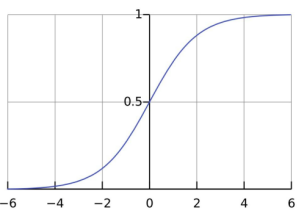
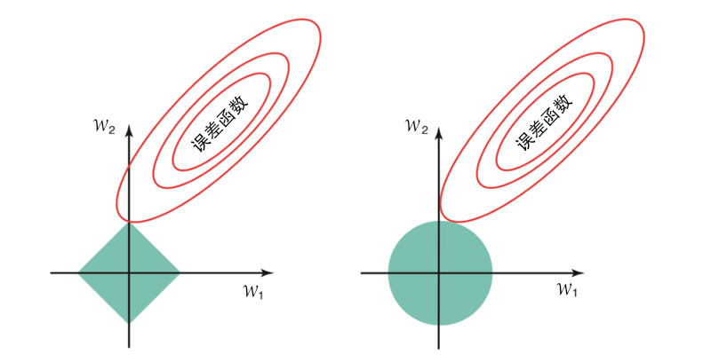

### 第 4 章 非线性模型

 

 

想学会飞翔，就必须先学会站立、行走、奔跑、攀登和跳舞，没有人能直接飞翔。
 

—— 尼采

 

 

让我们继续沿着从线性模型到非线性模型的道路进行探索，先从线性模型的逐渐修改开始，一步一步接触到非线性模型的精髓。

#### 4.1 logistic 回归

在统计学中，logistic 回归被用于预测分类变量的各种结果的概率。这个名字有一定的误导性，事实上 logistic 回归是一种分类技术，而不是回归。但这种分类的通过概率的估计得到的，因此使用术语“回归”。

logistic 回归大部分是由一个线性模型运行的，但 **logistic 函数** (图 4-1) 被用来将线性预测器的输出转化为一个 $0\sim1$ 的值，这也可以解释为概率。

 

图 4-1 logistic 函数把输入值以平稳的方式转换为 0~1 的输出值
  

标准的 logistic 函数由下式定义：
$$
P(t) = \frac{1}{1+e^{-t}} \tag{4-1}
$$
其中 $e$ 是欧拉数。变量 $t$ 可以是时间，不过这里 $t$ 是线性模型的输出，回顾式 $\text{(3-2)}$ 有：
$$
y = \frac{1}{1+e^{-(\boldsymbol{w}^\top\boldsymbol{x})}} \tag{4-2}
$$
这里线性模型 $\boldsymbol{w}$ 也可以包括一个常数值 $w_0$，前提是在输入值列表中人为添加一个总是等于 1 的输入值 $x_0$。 式 $\text{(4-2)}$ 可变化为： 
$$
\ln\frac{y}{1-y} = \boldsymbol{w}^\top\boldsymbol{x} \tag{4-3}
$$
因为我们将输出值 $y$ 看作是正例的概率，所以 $1-y$ 是其反例的概率，两者的比值：
$$
\frac{y}{1-y} \tag{4-4}
$$
称为**几率**，反映了 $\boldsymbol{x}$ 作为正例的相对可能性。因此式 $\text{(4-2)}$ 实际上是在用线性回归模型的预测结果去逼近真实标记的**对数几率**，因此 logistic 回归又被称为对数几率回归。

线性变换权重的最佳值是通过最大似然估计来确定的。给定数据集 $\{(\boldsymbol{x}_i,y_i)\}_{i=1}^l$，logistic 回归模型最大化对数似然：
$$
\text{LogLikelihood}(\boldsymbol{w}) = \sum_{i=1}^l \ln p(y_i|\boldsymbol{x}_i;\boldsymbol{w}) \tag{4-5}
$$
即令每个样本属于其真实标记的概率越大越好。令 $y_i$ 为所观察到的输出（1 或 0），对应输入为 $\boldsymbol{x}_i$。若正确分类为 1，则获得测量输出值 $y_i$ 的概率为 $p(y=1|\boldsymbol{x}_i)$；若正确分类标签为 0，则 $p(y=0|\boldsymbol{x}_i)=1-p(y=1|\boldsymbol{x}_i)$。于是式 $\text{(4-5)}$ 可以重写为：
$$
\text{LogLikelihood}(\boldsymbol{w}) = \sum_{i=1}^l\{y_i\ln p(y=1|\boldsymbol{x}_i,\boldsymbol{w}) + (1-y_i)\ln(1-p(y=1|\boldsymbol{x}_i,\boldsymbol{w}))\} \tag{4-6}
$$
似然率与系数（权重）$\boldsymbol{w}$ 的相关性已经非常明确了。 

因为 logistic 回归的输出就是正例的概率，显然有：
$$
\begin{align}
p(y=1|\boldsymbol{x}_i,\boldsymbol{w}) &= \frac{1}{1+e^{-(\boldsymbol{w}^\top\boldsymbol{x})}} = \frac{e^{\boldsymbol{w}^\top\boldsymbol{x}}}{1+e^{\boldsymbol{w}^\top\boldsymbol{x}}} \\
p(y=0|\boldsymbol{x}_i,\boldsymbol{w}) &= \frac{1}{1+e^{\boldsymbol{w}^\top\boldsymbol{x}}}
\end{align} \tag{4-7}
$$
因此最大化式 $\text{(4-6)}$ 等价于最小化
$$
L(\boldsymbol{w}) = \sum_{i=1}^l\Big(-y_i\boldsymbol{w}^\top\boldsymbol{x}_i + \ln(1+e^{\boldsymbol{w}^\top\boldsymbol{x}_i})\Big) \tag{4-8}
$$
由于上述表达式中的非线性性，我们不可能找到使似然函数最大化的权重的解析表达式，而必须用迭代过程来代替，例如梯度下降法。

#### 4.2 局部加权回归

本节中考虑的方法类似于最近邻值的输出的线性组合，但我们不会只关注 $K$ 个最近邻值而消除所有其他值的影响。这是一种平滑的变化：根据和被预测的实例之间的距离来逐渐减少实例对预测的影响，而不是选择一组 $K$ 个胜者。 

**局部加权回归**是一种懒惰的基于存储的技术，这意味着所有点和评估值都被存储了，而只有查询特定的某点的时候才会基于请求建立特定的模型。

为了预测一个点 $\boldsymbol{q}$（称为查询点）的评估结果，我们对训练点应用线性回归。为了确保在确定回归参数过程中的局部性（相近的点更相关），给每个样本点分配一个权重，这个权重会随着与查询点距离的增加而减小，我们用 $s_i$ 来表示。

加权后的最小二乘拟合的目标是最小化下面的加权误差（式 $\text{(3-3)}$ 中隐式地假设了每个点的权重是一样的）：
$$
\text{error}(\boldsymbol{w};s_1,...,s_n) = \sum_{i=1}^l s_i(\boldsymbol{w}^\top\boldsymbol{x}_i-y_i)^2 \tag{4-9}
$$
为了最小化式 $\text{(4-7)}$，可以令其关于 $\boldsymbol{w}$ 的梯度等于 0，得到如下解：
$$
\boldsymbol{w}^* = (\boldsymbol{X}^\top\boldsymbol{S}^2\boldsymbol{X})^{-1}\boldsymbol{X}^\top\boldsymbol{S}^2\boldsymbol{y} \tag{4-10}
$$
其中 $\boldsymbol{S} = \text{diag}(s_1,...,s_d)$。当所有权重相等时，式 $\text{(4-8)}$ 简化为式 $\text{(3-6)}$。 

根据存储的样本到查询点的距离，可以使用以下函数来描述它们的重要性：
$$
s_i = \exp\bigg(-\frac{\|\boldsymbol{x}_i-\boldsymbol{q}\|^2}{W_K}\bigg) \tag{4-11}
$$
其中 $W_K$ 是度量“核宽度”的一个参数，即对远距离实例的灵敏度；当距离远大于 $W_K$ 时，重要性迅速衰减至 0。 

#### 4.3 用 LASSO 来缩小系数和选择输入值

考虑线性回归模型时，岭回归是一种通过二次方式来惩罚大系数，从而使得模型更稳定的方法，如式 $\text{(3-7)}$ 所示。

普通的最小二乘估计法通常偏差较小，但是方差较大。为了提高准确率，有时可以将一些系数缩小或者设置为零。通过这样做，我们牺牲一点偏差，以减少预测值的方差，从而可以提高整体的预测准确率。

特征子集选择和岭回归，这两个改进估计的标准技术仍然存在一些缺陷：**子集选择**提供了便于解释的模型，但由于它是一个离散过程，输入变量要么保留，要么删除，该模型的变化也可能是特别大的；**岭回归**是一种连续让系数缩小，从而使得模型更稳定的过程，然而它没有设置任何系数为零，所以无法得出一个易于解释的模型。

 

图 4-2 在 LASSO 中，最好的解决方法出现在二次误差函数等高线接触正方形处，有时会在正方形的角上，对应某些零系数。相反，岭回归的二次约束没有角来让等高线接触，因此权重中很少会产生零
  

最小绝对收缩和选择算符 LASSO 使得一些系数缩小而另一些设置为零，因此保持了子集选择和岭回归两种方法的优势。LASSO 使用**权重绝对值**的总和作为约束 $\|\boldsymbol{w}\|_1$（参数向量的 $L_1$ 范数）。**LASSO 在系数绝对值总和小于一个常数的约束下，使得残差平方和最小化。**通过一个标准技巧，将带约束的优化问题通过拉格朗日乘数法转化为无约束的问题，这相当于将 $\lambda\|\boldsymbol{w}\|_1$ 加入无约束最小化的最小二乘：
$$
\text{LASSOerror}(\boldsymbol{w};\lambda) = \sum_{i=1}^l(\boldsymbol{w}^\top\boldsymbol{x}_i-y_i)^2+\lambda\sum_{j=0}^d|w_j| \tag{4-12}
$$
LASSO 和岭回归一个最主要的区别是，在岭回归中随着惩罚的增加，所有系数减小，但保持非零的状态，而 LASSO 随着惩罚的增加会导致更多的系数变为零。对应的权重为零的输入值就可以消除，从而导致模型使用较少的输入值（输入的**稀疏化**），因此更便于解释。换言之，作为模型构建过程的一部分，LASSO 是一种进行特征选择的嵌入式方法。

> 注意，式 $\text{(4-12)}$ 中 $\lambda\sum_{j=0}^d|w_j|$，当权重为零时不存在导数（偏导数从对应负值的 $-1$ 跳到对应正值的 $+1$），因此无法通过计算导数并令其等于零来求解。优化 LASSO 的问题可以通过引入带线性不等式约束的**二次规划**或更一般的凸优化方法来解决。$\lambda$ 的最佳值可以通过交叉验证来获得。 

> **拉格朗日乘数优化约束问题**
>
> LASSO 将带约束的优化问题转化为无约束的优化问题，并已被广泛应用。在数学优化中，**拉格朗日乘数法**是在带约束的前提下用来寻找函数局部最大值和最小值的方法。带约束问题是通过将各个约束乘以一个参数（一个拉格朗日乘数）转化为无约束的。