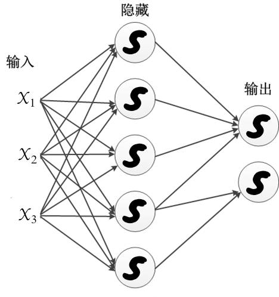

### 第 5 章 神经网络：多层感知器

 

 

大自然是大师中的大师，除非从他那里获得灵感，否则其他的都是徒劳无益。
 

—— 达·芬奇

 

 

单一的神经元是一个简单的计算单元，它计算一个标量积，接着是一个 S 型函数。人类的大脑证明，许多简单的单位连接起来的系统，可以产生令人难以置信的智能活动。

#### 5.1 多层感知器

4.1 节中的 logistic 回归模型，通过将 S 型传递函数应用到无限制的线性模型输出上，使得输出可以被解释为一个概率值，它是添加“最小限度的非线性”的简单方法。

> logistic 回归与没有隐藏层却有单一输出值的 MLP 网络有着相同的体系结构，改变的只是进行优化的函数：MLP 优化误差平方和，logistic 回归优化对数似然函数 (LogLikelihood)。

多层感知器神经网络是由大量的高度互联单元（神经元）构成的，它们平行工作，用于解决特定的问题。神经元以层的方式组织起来，之间有前馈信息流（无回路），如图 4-3 所示。

 

图 4-3 单隐藏层的多层感知器：隐藏层的 S 型传递函数引入非线性
  

对于每个层，每个单元首先计算权向量与前一层的输出给出的向量之间的标量积，得到的结果经过一个传递函数，产生下一层的输入。常用的光滑渐近传递函数是 S 型函数（图形形状像字母 S），之前遇见过的 logistic 转换就是一个例子（见图 4-1）。

虽然感知器的建模能力有限，只能用于输入能被输入空间中的一个超平面分开的分类问题，但是 MLP 却是一种通用逼近：如果有足够多的隐藏节点，拥有一个隐藏层的 MLP 能够以任意精度逼近任何光滑函数。

#### 5.2 通过反向传播法学习

跟往常一样，选择一个“向导”函数进行优化。例如光滑的（可导）平方误差和，并使用**梯度下降法**，迭代地计算函数关于权重系数的梯度，并且如果梯度不是 0 就朝着负梯度的方向移动一小步，使得函数值减小。

我们使用微积分中的**链式法则**来计算偏导数，以求得两个或更多函数的复合函数的导数。如果 $f$ 和 $g$ 分别是一个函数，然后链式法则指明如何从 $f$ 的 $g$ 的导数计算出复合函数 $f \circ g$ 的导数。例如 $f\circ g$ 的链式法则是：
$$
\frac{\text{d}f}{\text{d}x} = \frac{\text{d}f}{\text{d}g}\cdot\frac{\text{d}g}{\text{d}x}
$$
MLP 中的基本函数是：标量积，然后 S 型函数，接下来又是标量积，如此反复一直到输出层，计算误差。对于 MLP 网络，其梯度可以被高效地计算，它的计算需要的操作数正比于权重系数的数量，实际计算中所用的简单公式与前向传递（从输入到输出）类似，只是方向相反，从输出误差到输入，因此称之为误差的反向传播。目前，神经网络中的一个流行的技术就是通过误差的反向传播进行学习：计算梯度，然后沿着负梯度的方向小步移动。

> 梯度下降法只能达到局部最优点（梯度为 0），并不能保证是全局最优解。ML 的目标是泛化，对于这一目标，全局最优并非必要，甚至导致过度训练。

考虑标准的多层感知器，只有相邻的层之间有权重系数，差平方和能量函数定义为：
$$
E(\boldsymbol{w}) = \frac{1}{2}\sum_{p=1}^P E_p = \frac{1}{2}\sum_{p=1}^P (t_p-o_p)^2 \tag{5-1}
$$
其中 $t_p$ 和 $o_p$ 分别是目标值和当前 MLP 的输出值。S 型传递函数是 $f(x) = \frac{1}{1+e^{-x}}$。 

> $f(x) = \frac{1}{1+e^{-x}}$ 被称为 sigmoid 函数或 logistic 函数，它的导数很容易用它的输出表示：
> $$
> \frac{\text{d}f(x)}{\text{d}x} = f(x)\cdot(1-f(x))
> $$
> 因此在梯度下降法中计算导数会很方便，这也是经常采用 sigmoid 函数作为 S 型传递函数的原因。

**批量梯度下降**是梯度下降法的一个教科书版本。在得到了所有样本误差的梯度后，记为 $g_k = \nabla E(\boldsymbol{w}_k)$，下一次迭代 $k+1$ 的权重系数被下面的式子更新为：
$$
\boldsymbol{w}_{k+1} = \boldsymbol{w}_k - \epsilon g_k \tag{5-2}
$$
其中 $\epsilon$ 是表示学习率，其作用是控制每一步调整权的程度。 学习速率不应该太小，避免学习时间过长（每次迭代权重系数的改变都很小），学习速率也不应该太大，避免震荡导致的能量函数疯长（只有在步子很小时，沿着梯度方向的改变才能保证函数值减小）。

由于能量函数 $E$ 是许多项的和，每一项对应一个样本，因而梯度是相应的局部梯度 $\nabla E_p(\boldsymbol{w}_k)$ 的和，$\nabla E_p(\boldsymbol{w}_k)$ 是第 $p$ 个样本中误差的梯度 $(t_p-o_p)^2$。 

如果我们有上百万训练实例，首先对 $\nabla E_p(\boldsymbol{w}_k)$ 进行求和，然后走一小步。于是，马上会想到：在计算一个 $\nabla E_p(\boldsymbol{w}_k)$ 后立即沿着负梯度的方向走一小步会如何呢？如果这一步非常小，得到的权重与初始的差别将很小，并且接下来的梯度 $\nabla E_p(\boldsymbol{w}_{k+j})$ 将非常类似于原始的那些 $\nabla E_p(\boldsymbol{w}_k)$。 

如果以随机的顺序选择样本，就得到了**随机梯度下降**。

> 生物神经元不是很擅长复杂和长期的计算，所以随机梯度下降具有多种生物学意义。例如孩子学习识别数字，当他犯了一个错时，应该立即纠正，而不是等收集了成百上千的错误之后再纠正。

随机梯度下降的更新由下式给出：
$$
\boldsymbol{w}_{k+1} = \boldsymbol{w}_k - \epsilon\nabla E_p(\boldsymbol{w}_k) \tag{5-3}
$$
其中样本 $p$ 是每次迭代时从训练集中随机选择的，$\epsilon$ 是学习速率。相对于批量随机梯度下降，也就是 $E$ 的完整梯度被用作搜索方向，这种方法的优势在于，局部梯度 $\nabla E_p(\boldsymbol{w}_k)$ 只需要单一的向前和向后传递，因此该方法的不精确性可以通过单次迭代所需的较低计算量进行补偿。 

> 小批量反向传播是一个折中的选项，仅仅在一个随即大小为 $B$ 的样本子集（批）上运行向前和向后传播来积累部分梯度。每 $B$ 个向前传播修改权重。极端情况是，$B$ 等于 1 时相当于随机梯度下降，$B$ 等于样本的总数量时相当于批量梯度下降。 

#### 5.3 随机梯度下降的推导

现在我们考虑更一般的情况，MLP 网络包含多个输出单元。我们首先重新定义误差 $E$：
$$
E(\boldsymbol{w}) = \frac{1}{2}\sum_{p=1}^P\sum_{k=1}^K(t_{kp}-o_{kp})^2 \tag{5-4}
$$
其中 $t_{kp}$ 和 $o_{kp}$ 分别是训练样例 $p$ 第 $k$ 个输出单元对应的目标值和输出值。

随机梯度下降迭代地处理训练样例，每次处理一个。对于每个训练样例 $p$，利用这个样例对应误差的梯度$\nabla E_p(\boldsymbol{w})$ 修改权值。其中，$E_p$ 是训练样例 $p$ 的误差，通过对网络中所有输出单元的求和得到：
$$
E_p(\boldsymbol{w}) = \frac{1}{2}\sum_{k=1}^K(t_k-o_k)^2 \tag{5-5}
$$
我们增加一个下标 $j$ 来表示网络中的第 $j$ 个单元。

- $x_{ji}$：单元 $j$ 的第 $i$ 个输入
- $w_{ji}$：与单元 $j$ 的第 $i$ 个输入相关联的权值
- $net_j=\sum_i w_{ji}x_{ji}$：单元 $j$ 的输入的加权和
- $o_j$：单元 $j$ 计算出的输出
- $t_j$：单元 j 的目标输出
- $f$：sigmoid 函数
- $Downstream(j)$：单元的直接输入中包含单元 $j$ 的输出的单元的集合 

现在我们导出 $\nabla E_p(\boldsymbol{w})$ 的表达式，实现公式 $\text{(5-3)}$ 中所讲的随机梯度下降法则。 因为权值 $w_{ji}$ 仅能通过 $net_j$ 影响网络的其他部分，所以我们可以使用链式法则得到：
$$
\begin{align}
\frac{\partial E_p}{\partial w_{ji}} &= \frac{\partial E_p}{\partial net_j}\frac{\partial net_j}{\partial w_{ji}} \\
&=\frac{\partial E_p}{\partial net_j} x_{ji}
\end{align}\tag{5-6}
$$
于是，梯度下降的更新（式 $\text{(5-3)}$）可以重写为：
$$
{w_{ji}}_{k+1} = {w_{ji}}_k - \epsilon\frac{\partial E_p}{\partial net_j} x_{ji} \tag{5-7}
$$
下面我们剩下的任务就是为 $\frac{\partial E_p}{\partial net_j}$ 导出一个表达式，依次考虑两种情况：一种情况是单元 $j$ 是网络的一个输出单元， 另一种情况是 $j$ 是一个内部单元。 

**情况 1：输出单元的权值训练法则** 

就像 $w_{ji}$ 仅能通过 $net_j$ 影响网络一样，$net_j$ 仅能通过 $o_j$ 影响网络。我们再次使用链式法则：
$$
\begin{align}
\frac{\partial E_p}{\partial net_j} &= \frac{\partial E_p}{\partial o_j}\frac{\partial o_j}{\partial net_j} \\
&=\bigg(\frac{\partial}{\partial o_j}\frac{1}{2}\sum_{k=1}^K(t_k-o_k)^2\bigg)\bigg(\frac{\partial f(net_j)}{\partial net_j}\bigg) \\
&=\bigg(\frac{\partial}{\partial o_j}\frac{1}{2}(t_j-o_j)^2\bigg)f(net_j)(1-f(net_j))\\
&= \bigg(\frac{1}{2}2(t_j-o_j)\frac{\partial(t_j-o_j)}{\partial o_j}\bigg)o_j(1-o_j)\\
&=-(t_j-o_j)o_j(1-o_j)
\end{align}\tag{5-8}
$$
然后代入式 $\text{(5-7)}$，我们便推导出了输出单元的随机梯度下降法则：
$$
{w_{ji}}_{k+1}={w_{ji}}_k + \epsilon(t_j-o_j)o_j(1-o_j)x_{ji} \tag{5-9}
$$
**情况 2：隐藏单元的权值训练法则**

对于网络中的隐藏单元，推导 $w_{ji}$ 必须考虑 $w_{ji}$ 间接地影响网络输出，从而影响 $E_p$。因此我们定义网络中单元 $j$ 的所有直接下游单元的集合，用 $Downstream(j)$ 表示，$net_j$ 只能通过 $Downstream(j)$ 中的单元影响网络输出（在影响 $E_p$）。我们用 $\delta_i$ 来表示任意单元 $i$ 的 $-\frac{\partial E_p}{\partial net_i}$，可以得出如下推导：
$$
\begin{align}
\frac{\partial E_p}{\partial net_j} &= \sum_{k \in Downstream(j)}\frac{\partial E_p}{\partial net_k}\frac{\partial net_k}{\partial net_j}\\
&=\sum_{k\in Downstream(j)}-\delta_k \frac{\partial net_k}{\partial net_j} \\
&=\sum_{k \in Downstream(j)}-\delta_k\frac{\partial net_k}{\partial o_j}\frac{\partial o_j}{\partial net_j}\\
&=\sum_{k \in Downstream(j)}-\delta_k w_{kj}\frac{\partial o_j}{\partial net_j}\\
&=\sum_{k \in Downstream(j)}-\delta_k w_{kj} o_j(1-o_j)\\
&=-o_j(1-o_j)\sum_{k \in Downstream(j)}\delta_k w_{kj}
\end{align} \tag{5-10}
$$
然后代入式 $\text{(5-7)}$，我们便推导出了隐藏单元的随机梯度下降法则：
$$
{w_{ji}}_{k+1}={w_{ji}}_k + \epsilon \Bigg( o_j(1-o_j)\sum_{k \in Downstream(j)}\delta_k w_{kj}\Bigg)x_{ji} \tag{5-11}
$$
