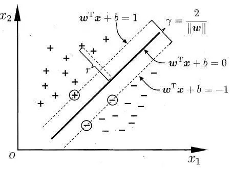
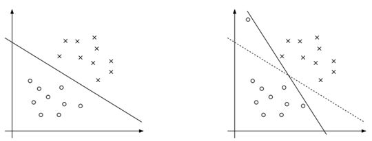

### 第 6 章 支持向量机

 

 

科学或许就是系统简化的艺术。
 

—— 卡尔·波普尔

 

 

支持向量机是线性判别方法的集大成者，它为了加强模型的泛化能力，往线性判别方法中加入了额外的优化目标。支持向量机的基本模型就是定义在特征空间上的间隔最大的线性分类器，其中支持向量就是那些处于安全间隔两侧边缘的点。间隔最大使它有别于感知机；支持向量机还包括核技巧，这使它成为实质上的非线性分类器。

为了得到最大间隔线性分类器，可以使用标准的**二次规划**，它可以在一定规模下解决此类优化问题。二次规划问题就是目标函数为二次函数、约束条件为线性的最优化问题。如果训练样本不是线性可分的，那么 SVM 需要先对原始样本点做**非线性的变换** $\phi$，从而将其变成（近似）线性可分的。可以将 $\phi$ 看作是一个合适的特征生成函数，它使得变换之后的两类样本点 $\phi(\boldsymbol{x})$ 是线性可分的。

为了找到合适的 $\phi$，还需要重新做特征提取和特征工程。在使用 $\phi$ 变换输入样本后，**SVM 的特征就是要识别的样本和训练样本之间所有的相似性值**，实际上只有**支持向量**才提供非零的贡献。

> SVM 关键的一步就是通过一些交叉验证的方式，人工确定最利于学习和泛化的相似度度量函数，其中就涉及**核函数**的选择。

SVM 可以看作解决了两个问题：一方面，它找到了一个衡量输入向量之间相关性的合适方式，即核函数 $K(\boldsymbol{x},\boldsymbol{y})$；另一方面，它构建了一个线性结构，该线性结构结合了训练样本的输出和新的测试样本，训练样本的输出用相似度来衡量。越相似的输入样本对输出的贡献越大，可以用类似下面的式子来描述：
$$
\sum_{i=1}^{l}\alpha_iy_i K(\boldsymbol{x},\boldsymbol{x}_i)
$$
其中 $l$ 是训练样本的数量，$y_i$ 是训练样本 $\boldsymbol{x}_i$ 的输出，$\boldsymbol{x}$ 是待分类的新测试样本。 核在计算函数 $\phi(\boldsymbol{x})$ 映射后数据点的点积时，实际上不用计算这个映射函数，这种方法被称作“核函数”：
$$
K(\boldsymbol{x},\boldsymbol{x}_i) = \boldsymbol{\varphi}(\boldsymbol{x})\cdot\boldsymbol{\varphi}(\boldsymbol{x}_i)
$$

#### 6.1 间隔和支持向量

在样本空间中，划分超平面可通过如下线性方程来描述：
$$
\boldsymbol{w}^\top\boldsymbol{x} + b = 0 \tag{6-1}
$$
其中 $\boldsymbol{w} = (w_1,…,w_d)$ 为法向量，决定了超平面的方向；$b$ 为位移项，决定了超平面与原点之间的距离。显然，划分超平面可被法向量 $\boldsymbol{w}$ 和位移 $b$ 确定。样本空间中任意点 $\boldsymbol{x}$ 到超平面的距离可写为：
$$
r = \frac{\vert\boldsymbol{w}^\top\boldsymbol{x}+b\vert}{\Vert\boldsymbol{w}\Vert} \tag{6-2}
$$
假设已标记的实例是线性可分的，这意味着存在一对 $(\boldsymbol{w},b)$ 使得：
$$
\begin{cases}
\boldsymbol{w}^\top\boldsymbol{x} + b \ge +1, &y = +1 \\
\boldsymbol{w}^\top\boldsymbol{x} + b \le -1,&y = -1
\end{cases} \tag{6-3}
$$
训练样本集中与超平面距离最近的训练样本点称为**支持向量**。如图 6-1 所示，支持向量使式 $\text{(6-3)}$ 的等号成立，即：

- 对于 $y=+1$ 的正例点，支持向量在超平面 $H_1:\boldsymbol{w}^\top\boldsymbol{x} + b = 1$ 上；
- 对于 $y=-1$ 的负例点，支持向量在超平面 $H_2:\boldsymbol{w}^\top\boldsymbol{x} + b = -1$ 上。

 

图 6-1 支持向量和间隔
  

可以看到 $H_1$ 和 $H_2$ 平行，划分超平面与它们平行且位于它们中央。其中两个异类支持向量到超平面的距离之和，或者说 $H_1$ 与 $H_2$ 之间的距离称为**间隔**，为：
$$
\gamma
 = \frac{2}{\Vert \boldsymbol{w} \Vert} \tag{6-4}
$$
我们要找到具有“最大间隔”的划分超平面，也就是要找到能满足 $\text{(6-3)}$ 中约束的参数 $\boldsymbol{w}$ 和 $b$，使得 $\gamma$ 最大。于是这一问题可以形式化为：
$$
\begin{gather}
\max_{\boldsymbol{w},b} \frac{2}{\Vert \boldsymbol{w} \Vert}\\
\text{s.t. } y_i(\boldsymbol{w}^\top\boldsymbol{x}_i + b) \ge 1, \quad i=1,...,l
\end{gather} \tag{6-5}
$$
显然，为了最大化间隔，仅需最大化 $\frac{1}{\Vert \boldsymbol{w} \Vert}$，这等价于最小化 $\Vert \boldsymbol{w} \Vert^2$。于是，式 $\text{(6-5)}$ 可重写为：
$$
\begin{gather}
\min_{\boldsymbol{w},b} \frac{1}{2} \Vert \boldsymbol{w} \Vert^2\\
\text{s.t. } y_i(\boldsymbol{w}^\top\boldsymbol{x}_i + b) \ge 1, \quad i = 1,...,l 
\end{gather}\tag{6-6}
$$
这就是**支持向量机**的基本型。

> 1. 间隔貌似仅与 $\boldsymbol{w}$ 有关，但事实上 $b$ 通过约束隐式地影响着 $\boldsymbol{w}$ 的取值，进而对间隔产生影响。
> 2. 在决定划分超平面时只有支持向量起作用，而其他样本点并不起作用。如果移动支持向量将改变所求的解，而移动其他样本点，甚至去掉这些点，解都不会改变。由于支持向量在确定划分超平面中起着确定性作用，因此将这种分类模型称为支持向量机。

#### 6.2 学习算法

式 $\text{(6-6)}$ 是一个凸二次规划问题，能直接用现成的优化计算包求解，但是我们可以有更高效的办法。

对式 $\text{(6-6)}$ 使用拉格朗日乘子法可得到其“对偶问题”。具体来说，对 $\text{(6-6)}$ 的每条约束添加拉格朗日乘子 $\alpha_i \ge 0$，则该问题的拉格朗日函数可以写为：
$$
L(\boldsymbol{w},b,\boldsymbol{\alpha}) = \frac{1}{2}\Vert\boldsymbol{w}\Vert^2 + \sum_{i=1}^l \alpha_i\big(1-y_i(\boldsymbol{w}^\top\boldsymbol{x}_i+b)\big) \tag{6-7}
$$
根据拉格朗日对偶性，原始问题 $\text{(6-6)}$ 的对偶问题是：
$$
\max_{\boldsymbol{\alpha}} \min_{\boldsymbol{w},b} L(\boldsymbol{w},b,\boldsymbol{\alpha}) \tag{6-8}
$$
所以需要先求 $L(\boldsymbol{w},b,\boldsymbol{\alpha})$ 对 $\boldsymbol{w},b$ 的极小，再求对 $\boldsymbol{\alpha}$ 的极大。令 $L(\boldsymbol{w},b,\boldsymbol{\alpha})$ 对 $\boldsymbol{w}$ 和 $b$ 的偏导为零可得：
$$
\begin{align}
\nabla_{\boldsymbol{w}}L(\boldsymbol{w},b,\boldsymbol{\alpha}) &= \boldsymbol{w} - \sum_{i=1}^l\alpha_i y_i \boldsymbol{x}_i = 0 \\
\nabla_{b}L(\boldsymbol{w},b,\boldsymbol{\alpha}) &= \sum_{i=1}^l \alpha_i y_i = 0
\end{align}
$$

$$
\boldsymbol{w} = \sum_{i=1}^l \alpha_iy_i\boldsymbol{x}_i \tag{6-9}
$$

$$
0 = \sum_{i=1}^l\alpha_i y_i \tag{6-10}
$$

将 $\text{(6-9)}$ 代入 $\text{(6-7)}$，即可将 $L(\boldsymbol{w},b,\boldsymbol{\alpha})$ 中的 $\boldsymbol{w}$ 和 $b$ 消去，
$$
\begin{align}
L(\boldsymbol{w},b,\boldsymbol{\alpha}) &= \frac{1}{2} \sum_{i=1}^l\sum_{j=1}^l \alpha_i\alpha_j y_i y_j \boldsymbol{x}_i^\top \boldsymbol{x}_j + \sum_{i=1}^l\alpha_i - \sum_{i=1}^l \alpha_iy_i\bigg(\Big(\sum_{j=1}^l \alpha_j y_j \boldsymbol{x}_j\Big)\boldsymbol{x}_i +b\bigg)\\
&=\sum_{i=1}^l \alpha_i - \frac{1}{2}\sum_{i=1}^l\sum_{j=1}^l \alpha_i\alpha_j y_i y_j\boldsymbol{x}_i^\top\boldsymbol{x}_j
\end{align}
$$
再考虑式 $\text{(6-10)}$ 的约束，式 $\text{(6-8)}$ 就可以化为
$$
\begin{gather}
\max_{\boldsymbol{\alpha}} \sum_{i=1}^l \alpha_i -\frac{1}{2}\sum_{i=1}^l\sum_{j=1}^l \alpha_i\alpha_j y_i y_j \boldsymbol{x}_i^\top\boldsymbol{x}_j \\
\text{s.t. } \sum_{i=1}^l\alpha_i y_i = 0,\\
\alpha_i \ge 0,i=1,...,l
\end{gather} \tag{6-11}
$$
将式 $\text{(6-11)}$ 的目标函数由求极大转换成求极小，就得到下面与之等价的对偶最优化问题：
$$
\begin{gather}
\min_{\boldsymbol{\alpha}} \frac{1}{2}\sum_{i=1}^l\sum_{j=1}^l \alpha_i\alpha_j y_i y_j \boldsymbol{x}_i^\top\boldsymbol{x}_j - \sum_{i=1}^l \alpha_i\\
\text{s.t. } \sum_{i=1}^l\alpha_i y_i = 0,\\
\alpha_i \ge 0,i=1,...,l
\end{gather} \tag{6-12}
$$
解出 $\boldsymbol{\alpha}$ 后，求出 $\boldsymbol{w}$ 和 $b$ 即可得到模型
$$
\begin{align}
f(\boldsymbol{x}) &= \text{sign}(\boldsymbol{w}^\top\boldsymbol{x} + b)\\
&= \text{sign}\bigg(\sum_{i=1}^l\alpha_iy_i\boldsymbol{x}_i^\top\boldsymbol{x} + b\bigg)
\end{align} \tag{6-13}
$$
注意到式 $\text{(6-6)}$ 中有不等式约束，因此上述过程需要满足 KKT (Karush-Kuhn-Tucker) 条件，即要求：
$$
\begin{cases}
\alpha_i \ge 0\\
y_i(\boldsymbol{w}^\top\boldsymbol{x}_i + b) - 1 \ge 0\\
\alpha_i(y_i(\boldsymbol{w}^\top\boldsymbol{x}_i + b)-1) = 0
\end{cases} \tag{6-14}
$$
于是，对任意训练样本 $(\boldsymbol{x}_i, y_i)$，总有 $\alpha_i = 0$ 或 $y_i(\boldsymbol{w}^\top\boldsymbol{x}_i + b) = 1$。

- 若 $\alpha_i= 0$，则该样本将不会在式 $\text{(6-13)}$  的求和中出现，也就不会对 $f(\boldsymbol{x})$ 有任何影响；
- 若 $\alpha_i > 0$，则必有 $y_if(\boldsymbol{x}_i) = 1$，所对应的样本点位于最大间隔边界上，是一个支持向量。

因此训练完成后，大部分的训练样本都不需保留，最终模型仅与支持向量有关。最终分类是由加权的子分类 $y_i$ 的线性组合决定的，这些权重由输入样本和实例样本的标量积（当前样例和实例 $\boldsymbol{x}_i$ 之间相似性的度量）和参数 $\alpha_i$ 确定。 

式 $\text{(6-12)}$ 是一个二次规划问题，可使用通用的二次规划算法来求解；然而，该问题的规模正比于训练样本数，这会在实际任务中造成很大的开销。为了避开这个障碍，人们通过利用问题本身的特性，提出了很多高效的算法，SMO 就是其中一个著名的代表。

SMO 的基本思想是先固定 $\alpha_i$ 之外的所有参数，然后求 $\alpha_i$ 上的极值。由于存在约束 $\sum_{i=1}^l \alpha_iy_i= 0$，若固定 $\alpha_i$ 之外的其他变量，则 $\alpha_i$ 可由其他变量导出。于是，SMO 每次选择两个变量 $\alpha_i$ 和 $\alpha_j$，并固定其他参数。这样，在参数初始化后，SMO 不断执行如下两个步骤直至收敛：

- 选取一对需更新的变量 $\alpha_i$ 和 $\alpha_j$；
- 固定 $\alpha_i$ 和 $\alpha_j$ 以外的参数，求解式 $\text{(6-12)}$ 获得更新后的 $\alpha_i$ 和 $\alpha_j$。

注意到只需选取的 $\alpha_i$ 和 $\alpha_j$ 中有一个不满足 KKT 条件 $\text{(6-14)}$，目标函数就会在迭代后减小。直观来看，KKT 条件违背的程度越大，则变量更新后可能导致的目标函数值减幅越大。于是，SMO 先选取违背 KKT 条件程度最大的变量。第二个变量应选择一个使目标函数值减小最快的变量，但由于比较各变量所对应的目标函数值减幅的复杂度过高，因此 SMO 采用了一个启发式：使选取的两变量所对应样本之间的间隔最大。

> 一种直观的解释是，这样的两个变量有很大的差别，与对两个相似的变量进行更新相比，对它们进行更新会带给目标函数值更大的变化。

SMO 算法之所以高效，恰由于在固定其他参数后，仅优化两个参数的过程能做到非常高效。具体来说，仅考虑 $\alpha_i$ 和 $\alpha_j$ 时，式 $\text{(6-12)}$ 中的约束可重写为
$$
\alpha_iy_i + \alpha_jy_j = c, \quad\alpha_i\ge0,\alpha_j\ge0 \tag{6-15}
$$
其中 $c = -\sum_{k \ne i,j} \alpha_k y_k$ 是使 $\sum_{i=1}^l\alpha_iy_i = 0$ 成立的常数。用 $\alpha_iy_i + \alpha_jy_j = c$ 消去式 $\text{(6-12)}$ 中的变量 $\alpha_j$，则得到一个关于 $\alpha_i$ 的单变量二次规划问题，仅有的约束是 $\alpha_i \ge 0$。这样的二次规划问题具有闭式解，于是不必调用数值优化算法即可高效地计算出更新后的 $\alpha_i \ge 0$ 和 $\alpha_j \ge 0$。 

最后确定偏置项 $b$。注意到对任意支持向量 $(\boldsymbol{x}_s,y_s)$ 都有 $y_s(\boldsymbol{w}^\top\boldsymbol{x}_s+b)=1$，即
$$
y_s\Bigg(\sum_{i\in S}\alpha_iy_i\boldsymbol{x}_i^\top\boldsymbol{x}_s + b\Bigg)=1 \tag{6-16}
$$
其中 $S = \{i \mid \alpha_i > 0, i = 1,2,…,m\}$ 为所有支持向量的下标集。理论上，可选取任意支持向量并通过求解式 $\text{(6-16)}$ 获得 $b$，但现实任务中常采用一种更鲁棒的做法：使用所有支持向量求解的平均值。
$$
b = \frac{1}{\vert S\vert}\sum_{s \in S}\Bigg(y_s - \sum_{i \in S}\alpha_iy_i\boldsymbol{x}_i^\top\boldsymbol{x}_s\Bigg) \tag{6-17}
$$

#### 6.3 非线性假设

上述技术可以扩展到非线性分类器，这需要将输入数据 $\boldsymbol{x}$ 映射成高维特征向量 $\boldsymbol{\varphi}(\boldsymbol{x})$ 并在转化后的特征空间再使用线性分类。

> 如果原始空间是有限维，即属性数有限，那么一定存在一个高维特征空间使样本线性可分。

于是，在特征空间中划分超平面可以表示为：
$$
\boldsymbol{w}^\top\boldsymbol{\varphi}(\boldsymbol{x}) + b = 0 \tag{6-18}
$$
类似于式 $\text{(6-6)}$，有：
$$
\begin{gather}
\min_{\boldsymbol{w},b} \frac{1}{2} \Vert \boldsymbol{w} \Vert^2\\
\text{s.t. } y_i(\boldsymbol{w}^\top\boldsymbol{\varphi}(\boldsymbol{x}_i) + b) \ge 1, \quad i = 1,...,l 
\end{gather}\tag{6-19}
$$
其对偶问题是：
$$
\begin{gather}
\max_{\boldsymbol{\alpha}} \sum_{i=1}^l \alpha_i -\frac{1}{2}\sum_{i=1}^l\sum_{j=1}^l \alpha_i\alpha_j y_i y_j \boldsymbol{\varphi}(\boldsymbol{x}_i)^\top\boldsymbol{\varphi}(\boldsymbol{x}_j) \\
\text{s.t. } \sum_{i=1}^l\alpha_i y_i = 0,\\
\alpha_i \ge 0,i=1,...,l
\end{gather} \tag{6-20}
$$
式中的 $\boldsymbol{\varphi}(\boldsymbol{x}_i)^\top\boldsymbol{\varphi}(\boldsymbol{x}_j)$ 就是样本 $\boldsymbol{x}_i$ 与 $\boldsymbol{x}_j$ 映射到特征空间之后的内积。但是特征空间的维数可能很高，甚至可能是无穷维，因此直接计算 $\boldsymbol{\varphi}(\boldsymbol{x}_i)^\top\boldsymbol{\varphi}(\boldsymbol{x}_j)$ 通常是非常困难的。为了避开这个障碍，我们引入核函数：
$$
K(\boldsymbol{x},\boldsymbol{y}) = \boldsymbol{\varphi}(\boldsymbol{x})\cdot\boldsymbol{\varphi}(\boldsymbol{y})
$$
于是式 $\text{(6-20)}$ 可以重写为：
$$
\begin{gather}
\max_{\boldsymbol{\alpha}} \sum_{i=1}^l \alpha_i -\frac{1}{2}\sum_{i=1}^l\sum_{j=1}^l \alpha_i\alpha_j y_i y_j K(\boldsymbol{x}_i,\boldsymbol{x}_j) \\
\text{s.t. } \sum_{i=1}^l\alpha_i y_i = 0,\\
\alpha_i \ge 0,i=1,...,l
\end{gather} \tag{6-21}
$$
现在 SVM 分类器变为：
$$
\begin{align}
f(\boldsymbol{x}) &= \text{sign}\bigg(\sum_{i=1}^l\alpha_iy_i\boldsymbol{\varphi}(\boldsymbol{x})^\top\boldsymbol{\varphi}(\boldsymbol{x}_i) + b\bigg)\\
&=\text{sign}\bigg(\sum_{i=1}^l\alpha_iy_iK(\boldsymbol{x},\boldsymbol{x}_i)+b\bigg)
\end{align}\tag{6-22}
$$
我们希望样本在特征空间内线性可分，因此特征空间的好坏对支持向量机的性能至关重要。问题是，在不知道特征映射的形式时，我们并不知道什么样的核函数是合适的，而核函数也仅是隐式定义了这个特征空间。于是，“核函数选择”成为支持向量机的最大变数，若核函数选择不合适，意味着将样本映射到了一个不合适的特征空间，很可能导致性能不佳。表 6-1 列出了常用的核函数：

 

表 6-1 常用的核函数

$$
\begin{array}{c|c} 
\hline 
名称 & 表达式 & 参数\\
\hline 
线性核 & K(\boldsymbol{x},\boldsymbol{y})=\boldsymbol{x}^\top\boldsymbol{y} & \\
\hline
多项式核 & K(\boldsymbol{x},\boldsymbol{y})=(\boldsymbol{x}^\top\boldsymbol{y})^d & d\ge1 \text{ 为多项式的次数}\\
\hline
高斯核 & K(\boldsymbol{x},\boldsymbol{y})=\exp(-\frac{\Vert\boldsymbol{x}-\boldsymbol{y}\Vert^2}{2\sigma^2}) & \sigma\gt0 \text{ 为高斯核的带宽(width)}\\
\hline
拉普拉斯核 & K(\boldsymbol{x},\boldsymbol{y})=\exp(-\frac{\Vert\boldsymbol{x}-\boldsymbol{y}\Vert}{\sigma}) & \sigma\gt0\\
\hline
\text{sigmoid 核} & K(\boldsymbol{x},\boldsymbol{y})=\tanh(\beta\boldsymbol{x}^\top\boldsymbol{y}+\theta) & \tanh \text{ 为双曲正切函数，} \beta\gt0，\theta\lt0\\
\hline
\end{array}
$$

 

此外，还可通过函数组合得到新的核函数，例如：

- 若 $K_1$ 和 $K_2$ 为核函数，则对于任意正数 $\gamma_1$、$\gamma_1$，其线性组合 $\gamma_1K_1+\gamma_2K_2$ 也是核函数。
- 若 $K_1$ 和 $K_2$ 为核函数，则核函数的直积 $K_1\otimes K_2(\boldsymbol{x},\boldsymbol{y})=K_1(\boldsymbol{x},\boldsymbol{y})K_2(\boldsymbol{x},\boldsymbol{y})$ 也是核函数。
- 若 $K_1$ 为核函数，则对于任意函数 $g(\boldsymbol{x})$，$K(\boldsymbol{x},\boldsymbol{y})=g(\boldsymbol{x})K_1(\boldsymbol{x},\boldsymbol{y})g(\boldsymbol{y})$ 也是核函数。

> 在核函数的选择方面有一些基本的经验，例如对于文本数据通常采用线性核，情况不明时可先尝试高斯核。此外，核函数不是 SVM 专用的，只要能将目标函数能完全地用内积的形式来表示，都可使用核函数来高效地计算高维向量空间的分类结果。

#### 6.4 不可分问题和软间隔

我们一直假定训练样本在原始空间或者映射后的特征空间中是线性可分的，即存在一个超平面能将不同类的样本完全划分开。然而，在现实任务中往往很难确定合适的核函数使得训练样本在特征空间中线性可分；退一步说，即便恰好找到了某个核函数使得训练集在特征空间中线性可分，也很难断定这个貌似线性可分的结果不是由于过拟合所造成的。

例如，看图 6-2 中的两张图：

 

图 6-2 噪声数据对模型的影响
  

可以看到当数据集中存在离群点（可能是噪声）时会造成超平面的移动，间隔缩小，可见以前的模型对噪声非常敏感。再有甚者，如果离群点在另外一个类中，那么这时候就线性不可分了。

缓解该问题的一个办法是允许支持向量机在一些样本上出错。为此，要引入**软间隔**的概念。具体来说，前面介绍的支持向量机形式是要求所有样本均满足约束：
$$
y_i(\boldsymbol{w}^\top\boldsymbol{x}_i+b)\ge1
$$
即要求所有样本都必须划分正确，这称为**硬间隔**，而软间隔则是允许某些样本不满足这个约束。根据软间隔的思想，我们把最优化问题调整为：
$$
\begin{gather}
\min_{\gamma,\boldsymbol{w},b}\frac{1}{2}\Vert\boldsymbol{w}\Vert^2+C\sum_{i=1}^l\xi_i \\
\text{s.t. } y_i(\boldsymbol{w}^\top\boldsymbol{x}_i+b)\ge1-\xi_i\\
\xi_i\ge0,\quad i=1,\cdots,l
\end{gather}\tag{6-23}
$$
这就是常用的**软间隔支持向量机**。非负变量 $\xi_i$ 被称为“松弛变量”，引入 $\xi_i$ 后就允许某些样本点的函数间隔小于 1 甚至为负，即样本点在间隔区间之内甚至可以在对方的区域内。而放松限制条件后，我们需要重新调整目标函数，以对离群点进行处罚，因此在目标函数后面加上 $C\sum_{i=1}^l\xi_i$。这里的 $C$ 是离群点的权重， $C$ 越大表明离群点对目标函数影响越大，也就是越不希望看到离群点。

> 当 $C$ 无穷大时，式 $\text{(6-23)}$ 等价于式 $\text{(6-6)}$；当 $C$ 取有限值时，式 $\text{(6-23)}$ 允许一些样本不满足约束。

与之前的做法相似，我们也使用拉格朗日对偶性将最优化问题转换为对偶问题。首先，通过拉格朗日乘子法构造式 $\text{(6-23)}$ 的拉格朗日函数：
$$
\begin{align}L(\boldsymbol{w},b,\boldsymbol{\alpha},\boldsymbol{\xi},\boldsymbol{\mu})&=\frac{1}{2}||\boldsymbol{w}||^2+C\sum_{i=1}^{l}\xi_i+\sum_{i=1}^l\alpha_i\big(1-\xi_i-y_i(\boldsymbol{w}^\top\boldsymbol{x}_i+b)\big)-\sum_{i=1}^l\mu_i\xi_i\end{align} \tag{6-24}
$$
其中 $\alpha_i\ge0$，$\mu_i\ge0$ 是拉格朗日乘子。根据拉格朗日对偶性，原始问题的对偶问题是极大极小问题：
$$
\max_{\boldsymbol{\alpha}}\min_{\boldsymbol{w},b,\boldsymbol{\xi}}L(\boldsymbol{w},b,\boldsymbol{\alpha},\boldsymbol{\xi},\boldsymbol{\mu}) \tag{6-25}
$$
令 $L(\boldsymbol{w},b,\boldsymbol{\alpha},\boldsymbol{\xi},\boldsymbol{\mu})$ 对 $\boldsymbol{w},b,\xi_i$ 的偏导为零可得：
$$
\begin{align}
\boldsymbol{w}&=\sum_{i=1}^l\alpha_iy_i\boldsymbol{x}_i \\
0 &= \sum_{i=1}^l\alpha_iy_i\\
C &= \alpha_i + \mu_i
\end{align} \tag{6-26}
$$
把 $\text{(6-26)}$ 代入 $\text{(6-24)}$，即得：
$$
\begin{align}L(\boldsymbol{w},b,\boldsymbol{\alpha},\boldsymbol{\xi},\boldsymbol{\mu})&=\frac{1}{2}\boldsymbol{w}^\top\boldsymbol{w}+C\sum_{i=1}^l\xi_i+\sum_{i=1}^l\alpha_i-\sum_{i=1}^l\alpha_i\xi_i\\&\quad-\sum_{i=1}^l\alpha_iy_i(\boldsymbol{w}^\top\boldsymbol{x}_i)-\sum_{i=1}^l\alpha_iy_ib-\sum_{i=1}^l\mu_i\xi_i\end{align}
$$
因为 $\sum_{i=1}^l\alpha_iy_i=0$，所以 $\sum_{i=1}^l\alpha_iy_ib=0$；又因为 $C=\alpha_i+\mu_i$，所以
$$
C\sum_{i=1}^l\xi_i-\sum_{i=1}^l\alpha_i\xi_i-\sum_{i=1}^l\mu_i\xi_i=\sum_{i=1}^l(C-\alpha_i-\mu_i)\xi_i=0
$$
所以上式可以进一步简化为：
$$
\begin{align}L(\boldsymbol{w},b,\boldsymbol{\alpha},\boldsymbol{\xi},\boldsymbol{\mu})&=\frac{1}{2}\boldsymbol{w}^\top\boldsymbol{w}+\sum_{i=1}^l\alpha_i-\sum_{i=1}^l\alpha_iy_i(\boldsymbol{w}^\top\boldsymbol{x}_i)\\&=\frac{1}{2}\boldsymbol{w}^\top\sum_{i=1}^l\alpha_iy_i\boldsymbol{x}_i-\boldsymbol{w}^\top\sum_{i=1}^l\alpha_iy_i\boldsymbol{x}_i+\sum_{i=1}^l\alpha_i\\&=-\frac{1}{2}\bigg(\sum_{i=1}^l\alpha_iy_i\boldsymbol{x}_i\bigg)^\top\sum_{i=1}^l\alpha_iy_i\boldsymbol{x}_i+\sum_{i=1}^l\alpha_i\\&=\sum_{i=1}^l\alpha_i-\frac{1}{2}\sum_{i=1}^l\sum_{j=1}^l\alpha_i\alpha_jy_iy_j\boldsymbol{x}_i{}^\top\boldsymbol{x}_j\end{align}
$$
于是式 $\text{(6-25)}$ 可以进一步化为：
$$
\begin{gather}
\max_{\boldsymbol{\alpha}}\sum_{i=1}^l\alpha_i-\frac{1}{2}\sum_{i=1}^l\sum_{j=1}^l\alpha_i\alpha_jy_iy_j\boldsymbol{x}_i^\top\boldsymbol{x}_j\\
\text{s.t. } \sum_{i=1}^l\alpha_iy_i=0,\\
0\le\alpha_i\le C,\quad i=1,\cdots,l
\end{gather} \tag{6-27}
$$
将上式与硬间隔下的对偶问题对比可以看到，两者唯一的差别就在于对偶变量的约束不同，$\alpha_i$ 又多了 $\alpha_i\le C$ 的限制。于是，可采用第 6.2 节中同样地算法求解 $\text{(6-27)}$。同样地，对软间隔支持向量机的 KKT 条件也发生了变化：
$$
\begin{cases}\alpha_i\ge0,\quad\mu_i\ge0\\
y_i(\boldsymbol{w}^\top\boldsymbol{x}_i+b)-1+\xi_i\ge0\\
\alpha_i\Big(y_i(\boldsymbol{w}^\top\boldsymbol{x}_i+b)-1+\xi_i\Big)=0\\\xi_i\ge0,\quad\mu_i\xi_i=0\end{cases} \tag{6-28}
$$
于是，对任意训练样本 $(\boldsymbol{x}_i,y_i)$，总有 $\alpha_i=0$ 或 $y_i(\boldsymbol{w}^\top\boldsymbol{x}_i+b)=1-\xi_i$。

- 若 $\alpha_i=0$，则该样本不会对模型有任何影响；
- 若 $\alpha_i\gt0$，则必有 $y^{(i)}(\boldsymbol{w}^T\boldsymbol{x}^{(i)}+b)=1-\xi_i$，即该样本是支持向量：由 $C=\alpha_i+\mu_i$，若 $\alpha_i\lt C$，则 $\mu_i\gt0$，进而有 $\xi_i=0$，即该样本恰在最大间隔边界上；若 $\alpha_i=C$，则有 $\mu_i=0$，此时若 $\xi_i\le 1$ 则该样本落在最大间隔内部，若 $\xi_i\gt1$ 则该样本被错误分类。

由此可以看出，软间隔支持向量机的最终模型也仅与支持向量有关。