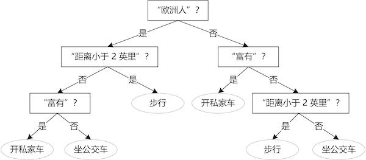

### 第 7 章 决策树和森林

 

 

如果森林中的一棵树倒下了，但是没有人听见，那么它是否发出了声音？
 

 

 

规则是一种将知识模块用让人易于理解的方式结合起来的方法。例如，如果“客户很富有”，那么“他将会购买我的产品”；如果“体温超过 37 摄氏度”，那么“这个人生病了”。决策规则普遍应用于医疗、银行和保险领域。

提取知识模块形成一个简单规则的集合是诱人的，但是手工设计和维护规则是昂贵且困难的。当规则集变大时，复杂性就会显现，像下面的规则会导致不同甚至矛盾的分类。因此从数据中自动提取不矛盾的规则的方法是很宝贵的。

规则 1：如果“富有”，那么“开私家车” 
规则 2：如果“欧洲人”且“距离小于 2 英里”，那么“步行” 
输入：富有的欧洲人，距离 1 英里 
输出：？

相比处理带有很多测试的非常长的前提，将规则分解为一串简单的问题更有价值。在贪心法中，那些信息量最大的问题最好放在这一序列的前面，这样可以给问题加上层次结构，从信息量最大的问题到信息量最小的问题。这些动机很自然地让我们考虑到**决策树**，它是决策规则的有组织的分层排列，并且没有矛盾（见图 7-1）。

图 7-1 决策树

#### 7.1 构造决策树

决策树是以层次的方式组织起来的一个问题集，并且用一棵树的图形来表示。对于一件给定的事物，决策树通过连续地提出关于其已知属性的问题来估计它的一个未知属性。下一个问题问什么取决于前一个问题的答案，事物对应于这棵树中的一个路径，决策根据这条路径的终端节点来做出。终端节点称作叶子。

我们需要从初始的混乱的集合过渡到最终一系列（几乎）纯的集合。**贪心**法就是从“信息量最大”的问题开始，以尽可能接近最终目标这一原则迈出第一步，使得划分出的两个子集尽可能纯净。这一次划分完成之后，以递归地方式继续对左右两个子集使用同样的方法，设计合适的问题，如此重复，直到剩下的集合足够纯净，递归停止。

形式化来说，决策树学习可以用以下算法来描述：

输入：训练集 $D = \{(\boldsymbol{x}_1,y_1),...,(\boldsymbol{x}_l,y_l)\}$；属性集 $A = \{a_1,...,a_d\}$ 
过程：函数 $\text{TreeGenerate}(D,A)$ 
$\quad$生成结点 $\text{node}$ 
$\quad \text{if } D$ 中样本全属于同一类别 $C \text{ then}$ 
$\quad\quad$将 $\text{node}$ 标记为 $C$ 类叶子节点；$\text{return}$  
$\quad \text{end if}$ 
$\quad \text{if } A=\varnothing \text{ OR } D$ 中样本在 $A$ 上取值相同 $\text{ then}$  
$\quad\quad$ 将 $\text{node}$ 标记为叶子节点，其类别标记为 $D$ 中样本数最多的类；$\text{return}$  
$\quad \text{end if}$ 
$\quad$从 $A$ 中选择最优划分属性 $a_*$ 
$\quad \text{for } a_*$ 的每一个值 $a_*^v \text{ do}$ 
$\quad\quad$为 $\text{node}$ 生成一个分支；令 $D_v$ 表示 $D$ 中在 $a_*$ 上取值为 $a_*^v$ 的样本子集 
$\quad\quad\text{if } D_v$ 为空 $\text{then}$ 
 $\quad\quad\quad$将分支节点标记为叶子节点 ，其类别标记为 $D$ 中样本最多的类；$\text{return}$ 
$\quad\quad\text{else}$ 
$\quad\quad\quad$以 $\text{TreeGenerate}(D_v,A-\{a_*\})$ 为分支节点 
$\quad\quad\text{end if}$ 
$\quad\text{end for}$ 
输出：以 $\text{node}$ 为根节点的一棵决策树

可以看到，在决策树基本算法中，有 3 种情形会导致递归返回：(1) 当前节点包含的样本属于同一类别，无需划分；(2) 当前属性集为空，或是所有样本在所有属性上取值相同，无法划分；(3) 当前节点包含的样本集合为空，不能划分。

在第 (2) 种情形下，我们把当前节点标记为叶子节点，并将其类别设定为该节点所含样本最多的类别；在第 (3) 种情形下，同样把当前节点标记为叶子节点，但将其类别设定为其父节点所含样本最多的类别。

> 这两种情形的处理实质不同：情形 (2) 是在利用当前节点的后验分布，而情形 (3) 则是把父节点的样本分布作为当前节点的先验分布。

#### 7.2 划分选择

决策树的关键就是如何选择最优划分属性，我们希望决策树的分支节点所包含的样本尽可能属于同一类别，即节点的“纯度”越来越高。下面介绍两种广泛使用的子集纯度度量：信息增益和基尼指数。

**信息增益**

设想我们从一个内部节点或叶子结点对应的集合中进行抽样，我们得到 $y$ 类实例的概率 $\text{Pr}(y)$ 正比于集合中该类实例所占的比例。集合的类统计不确定性由标记概率分布的香农熵来度量：
$$
\text{Ent}(D) = -\sum_{y\in Y}\text{Pr}(y) \log\text{Pr}(y) \tag{7-1}
$$
当所有 $n$ 个类别的实例均分了一个集合时，熵达到最大值 $\text{Ent}(D) = \log n$；而当所有实例都属于同一类别时（这种情况下，不需要任何信息就知道我们会得到什么类别了），熵达到最小值 $\text{Ent}(D) = 0$。

> 在信息论中，熵量化了确定某件事件发生所需的平均信息。如果对数的底为 2，信息（也就是熵）的单位是二进制位 (bit)。

在信息增益方法中，**一个集合的混度由类别概率分布的熵来度量**。

知道一个问题的答案将会降低熵，或者熵保持不变（仅当答案不取决于类别）。令 $D$ 表示目前的实例集，并且让 $D = D_1\cup ...\cup D_V$ 表示问过一个关于某属性问题之后的划分。在知道了答案后 